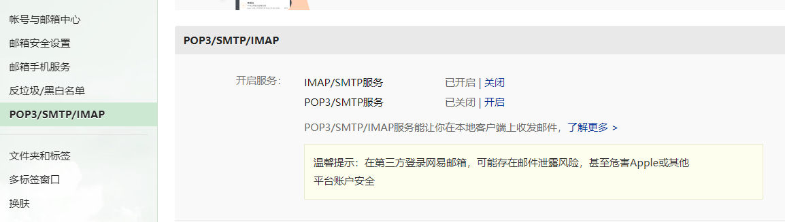
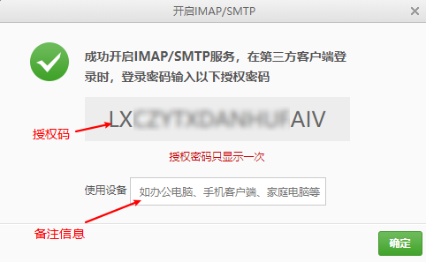
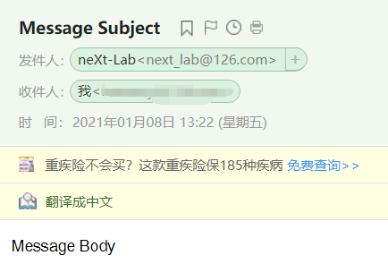

# GitLab

*summary*


**GitLab**是一个代码仓库。

---

*pinned*

### Git安装

- `yum -y install git`

### 安装方式

> [docker-compose搭建gitlab并配置邮箱](https://blog.csdn.net/u014691098/article/details/106972399/)
>
> [基于docker-compose搭建gitlab](https://www.cnblogs.com/sonyy/p/13150691.html)

- 推荐安装Omnibus的GitLab CE的Docker版本，这边提供了一步式docker-compose.yml文件示例

  - 初次运行请执行：

    ``` sh
    $ sudo docker run --detach \
      --publish 23456:80\
      --name gitlab \
      --restart always \
      --volume /your-workstation/gitlab/config:/etc/gitlab \
      --volume /your-workstation/gitlab/log:/var/log/gitlab \
      --volume /your-workstation/gitlab/data:/var/opt/gitlab \
      gitlab/gitlab-ce:latest
    ```

  - 然后使用的docker-compose文件：

    ```yml
    version: '3.6'
    
    services:
      gitlab:
        restart: always
        image: 'gitlab/gitlab-ce:latest'
        environment:
          TZ: 'Asia/Shanghai'
          GITLAB_OMNIBUS_CONFIG: |
            external_url 'http://10.11.6.128:8880'
        ports:
          - "8880:80"
        volumes:
          - ./config:/etc/gitlab
          - ./log:/var/log/gitlab
          - ./data:/var/opt/gitlab
        privileged: true
    ```

---

*2021.01.03*

### 常用的调试命令

> [GitLab常用命令](http://www.chenxm.cc/article/708.html)

许多时候GitLab会发生意想不到的错误，这时候要进入容器内部执行一些调试命令行来排查。

- 检查配置：`gitlab-ctl check-config`
- 查看状态：`gitlab-ctl status`
- 查看运行时日志：`gitlab-ctl tail`
- 重新应用配置：`gitlab-ctl reconfigure`
- nginx日志：`cd /var/log/gitlab/nginx`和`cat gitlab_error.log`

### 施工中：[execute] fail: gitaly: runsv not running

https://blog.csdn.net/jia12216/article/details/88352711

[502](https://www.cnblogs.com/sonyy/p/13150691.html)

[【Git学习】解决GitLab内存消耗大的问题](https://ouyangpeng.blog.csdn.net/article/details/84066417)

---

*2021.01.05*

### 施工中：安装一个GitLab Runner(Docker)

- 首先要启动一个GitLab Runner容器

  - > [Run GitLab Runner in a container](https://docs.gitlab.com/runner/install/docker.html)

    ```sh
       docker run -d --name gitlab-runner --restart always \
         -v /srv/gitlab-runner/config:/etc/gitlab-runner \
         -v /var/run/docker.sock:/var/run/docker.sock \
         gitlab/gitlab-runner:latest
    ```
  
- 然后在挂载出来的config目录下创建`config.toml`，在里面写入相关配置

- `docker restart gitlab-runner`重启以应用配置

---

*2020.01.08*

### 配置邮件通知

> [Gitlab-ce添加邮件找回密码和代码推送提醒功能](https://www.58jb.com/html/158.html)
>
> [SMTP settings](https://docs.gitlab.com/omnibus/settings/smtp.html)
>
> [如何配置客户端软件？](http://www.126.com/help/client_04.htm)

- 注册一个新的邮箱账号（比如126）

  - 举例：`myEmail@126.com`和它的密码`password`

- 配置`gitlab.rb`后`gitlab-ctl reconfigure`

  ```yaml
  gitlab_rails['gitlab_email_from'] = 'myEmail@126.com'
  gitlab_rails['gitlab_email_display_name'] = 'myLab'
  gitlab_rails['smtp_enable'] = true
  gitlab_rails['smtp_address'] = "smtp.126.com"
  gitlab_rails['smtp_port'] = 25 
  gitlab_rails['smtp_user_name'] = "myEmail@126.com"
  gitlab_rails['smtp_password'] = "password"
  gitlab_rails['smtp_domain'] = "126.com"
  gitlab_rails['smtp_authentication'] = "login"
  gitlab_rails['smtp_enable_starttls_auto'] = false
  ```

- 测试后发现并没有发送出邮件。

- **如何调试**：运行`gitlab-rails console`来进入控制台，启动过程有点慢，耐心等待到出现以下信息即可。

  ```txt
  --------------------------------------------------------------------------------
   GitLab:       13.4.1 (c90be62bdef) FOSS
   GitLab Shell: 13.7.0
   PostgreSQL:   11.9
  --------------------------------------------------------------------------------
  Loading production environment (Rails 6.0.3.1)
  irb(main):
  ```

  - 这句代码可以使用上面的配置立即发送一封邮件

    ```js
    Notify.test_email('destination_email@address.com', 'Message Subject', 'Message Body').deliver_now
    ```

  - 现在就可以看到报错了：

    ```log
    Traceback (most recent call last):
            2: from (irb):2
            1: from (irb):2:in `rescue in irb_binding'
    Net::SMTPAuthenticationError (550 �û���Ȩ��½)
    ```

- 使用126的SMTP服务器，并添加授权信息

  - > [【selenium+Python unittest】之使用smtplib发送邮件错误：smtplib.SMTPDataError：（554）、smtplib.SMTPAuthenticationError（例：126邮箱）](https://www.cnblogs.com/Owen-ET/p/8409141.html)

  - 在`myEmail@126.com`邮箱中开启SMTP服务

    

  - 用**授权码**替换掉上面的`password`，然后重新`reconfigure`

    

- 最终邮件通知成功

  

