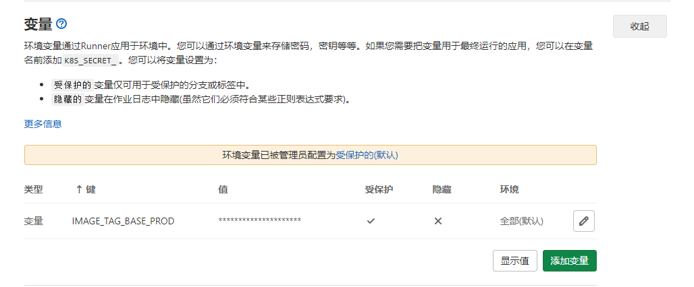

# GitLab

*summary*


**GitLab**是一个代码仓库。

---

*pinned*

### Git安装

- `yum -y install git`

### 安装方式

> [docker-compose搭建gitlab并配置邮箱](https://blog.csdn.net/u014691098/article/details/106972399/)
>
> [基于docker-compose搭建gitlab](https://www.cnblogs.com/sonyy/p/13150691.html)

- 推荐安装Omnibus的GitLab CE的Docker版本，这边提供了一步式docker-compose.yml文件示例

  - 初次运行请执行：

    ``` sh
    $ sudo docker run --detach \
      --publish 23456:80\
      --name gitlab \
      --restart always \
      --volume /your-workstation/gitlab/config:/etc/gitlab \
      --volume /your-workstation/gitlab/log:/var/log/gitlab \
      --volume /your-workstation/gitlab/data:/var/opt/gitlab \
      gitlab/gitlab-ce:latest
    ```

  - 然后使用的docker-compose文件：

    ```yml
    version: '3.6'
    
    services:
      gitlab:
        restart: always
        image: 'gitlab/gitlab-ce:latest'
        environment:
          TZ: 'Asia/Shanghai'
          GITLAB_OMNIBUS_CONFIG: |
            external_url 'http://10.11.6.128:8880'
        ports:
          - "8880:80"
        volumes:
          - ./config:/etc/gitlab
          - ./log:/var/log/gitlab
          - ./data:/var/opt/gitlab
        privileged: true
    ```

---

*2021.01.03*

### 常用的调试命令

> [GitLab常用命令](http://www.chenxm.cc/article/708.html)

许多时候GitLab会发生意想不到的错误，这时候要进入容器内部执行一些调试命令行来排查。

- 检查配置：`gitlab-ctl check-config`
- 查看状态：`gitlab-ctl status`
- 查看运行时日志：`gitlab-ctl tail`
- 重新应用配置：`gitlab-ctl reconfigure`
- nginx日志：`cd /var/log/gitlab/nginx`和`cat gitlab_error.log`

### [execute] fail: gitaly: runsv not running

> 这个问题并未完全解决，以下草稿仅供参考，很可能有杂乱/缺失/错误等情况

https://blog.csdn.net/jia12216/article/details/88352711

[502](https://www.cnblogs.com/sonyy/p/13150691.html)

[【Git学习】解决GitLab内存消耗大的问题](https://ouyangpeng.blog.csdn.net/article/details/84066417)

---

*2021.01.05*

### 安装一个GitLab Runner(Docker)

- 首先要启动一个GitLab Runner容器

  - > [Run GitLab Runner in a container](https://docs.gitlab.com/runner/install/docker.html)

    ```sh
       docker run -d --name gitlab-runner --restart always \
         -v /{你的配置文件路径}/config:/etc/gitlab-runner \
         -v /var/run/docker.sock:/var/run/docker.sock \
         gitlab/gitlab-runner:latest
    ```
  
- **(初始化新手向推荐)**`docker exec -it gitlab-runner bash`并`gitlab-runner register`来按照向导手动输入各项配置
  
  - **Enter the GitLab instance URL**：你的gitlab网站，`http://gitlab.example.com`
  - **Enter the registration token**：`http://gitlab.example.com/admin/runners`可以看到注册令牌
  - **Enter tags for the runner**：runner适用的tags
  - **Enter an executor**：因为这里是使用Docker安装，因此就输入`docker`
  - **Enter the default Docker image**：runner使用的基础系统镜像，这个基础镜像的制作也是一门学问
  
- **(老手推荐)**在挂载出来的config目录下创建`config.toml`，在里面写入相关配置

- `docker restart gitlab-runner`重启以应用配置

- 后续建议添加`docker-compose.yml`

  ```yaml
  version: '3'
  services:
      gitlab-runner:
          image: gitlab/gitlab-runner
          restart: unless-stopped
          privileged: true
          volumes:
            - ./config:/etc/gitlab-runner
            - /var/run/docker.sock:/var/run/docker.sock
            - /bin/docker:/bin/docker
            - /root/.ssh:/root/.ssh
  ```

#### 问题：runner需要使用宿主机的docker

> [gitlab-runner+docker自动化集成+遇到的问题汇总](https://blog.csdn.net/bpqdwo/article/details/93715719)
>
> [容器运行Gitlab-Runner时无法使用docker命令](https://blog.csdn.net/dario_op/article/details/98872977)

跑流水线时报错：`docker: command not found`

- 先使用上述`docker-compose.yml`把宿主机的关键文件挂载

- 在`config.toml`中增加docker命令挂载

  ```toml
  volumes = ["/var/run/docker.sock:/var/run/docker.sock", "/usr/bin/docker:/usr/bin/docker","其他挂载..."]
  ```

#### 问题：日志输出过多

往往是由于部分命令输出过多引起的，分类情况讨论

- `mvn verify`：改为`mvn -q verify`，仅输出报错（[Maven Command Line Options](https://books.sonatype.com/mvnref-book/reference/running-sect-options.html#running-sect-verbose-option)）

#### 问题：docker login的用户密码

> [denied: requested access to the resource is denied](https://blog.csdn.net/benben_2015/article/details/83445696)

可以选择在`gitlab-ci.yml`里明文或采用变量登录仓库

- 更好的方式是挂载`config.json`

  - 在`config.toml`中增加docker配置文件挂载

    ```toml
    volumes = ["/root/.docker/:/root/.docker/","其他挂载..."]
    ```

  - 然后在`gitlab-runner`容器中`docker login`一次，就会生成auth认证，这样由这个runner执行的作业都无需在流水线中手动登录

#### 问题：ssh需要免密认证/maven镜像源

你应该已经明白了，如何将宿主机的文件搬进runner创建的容器内

- 先使用上述`docker-compose.yml`把宿主机的关键文件挂载

- 在`config.toml`中增加docker命令挂载

  ```toml
  volumes = ["/root/.ssh:/root/.ssh","其他挂载..."]
  ```

---

*2020.01.08*

### 配置邮件通知

> [Gitlab-ce添加邮件找回密码和代码推送提醒功能](https://www.58jb.com/html/158.html)
>
> [SMTP settings](https://docs.gitlab.com/omnibus/settings/smtp.html)
>
> [如何配置客户端软件？](http://www.126.com/help/client_04.htm)

- 注册一个新的邮箱账号（比如126）

  - 举例：`myEmail@126.com`和它的密码`password`

- 配置`gitlab.rb`后`gitlab-ctl reconfigure`

  ```yaml
  gitlab_rails['gitlab_email_from'] = 'myEmail@126.com'
  gitlab_rails['gitlab_email_display_name'] = 'myLab'
  gitlab_rails['smtp_enable'] = true
  gitlab_rails['smtp_address'] = "smtp.126.com"
  gitlab_rails['smtp_port'] = 25 
  gitlab_rails['smtp_user_name'] = "myEmail@126.com"
  gitlab_rails['smtp_password'] = "password"
  gitlab_rails['smtp_domain'] = "126.com"
  gitlab_rails['smtp_authentication'] = "login"
  gitlab_rails['smtp_enable_starttls_auto'] = false
  ```

- 测试后发现并没有发送出邮件。

- **如何调试**：运行`gitlab-rails console`来进入控制台，启动过程有点慢，耐心等待到出现以下信息即可。

  ```txt
  --------------------------------------------------------------------------------
   GitLab:       13.4.1 (c90be62bdef) FOSS
   GitLab Shell: 13.7.0
   PostgreSQL:   11.9
  --------------------------------------------------------------------------------
  Loading production environment (Rails 6.0.3.1)
  irb(main):
  ```

  - 这句代码可以使用上面的配置立即发送一封邮件

    ```js
    Notify.test_email('destination_email@address.com', 'Message Subject', 'Message Body').deliver_now
    ```

  - 现在就可以看到报错了：

    ```log
    Traceback (most recent call last):
            2: from (irb):2
            1: from (irb):2:in `rescue in irb_binding'
    Net::SMTPAuthenticationError (550 �û���Ȩ��½)
    ```

- 使用126的SMTP服务器，并添加授权信息

  - > [【selenium+Python unittest】之使用smtplib发送邮件错误：smtplib.SMTPDataError：（554）、smtplib.SMTPAuthenticationError（例：126邮箱）](https://www.cnblogs.com/Owen-ET/p/8409141.html)

  - 在`myEmail@126.com`邮箱中开启SMTP服务

    

  - 用**授权码**替换掉上面的`password`，然后重新`reconfigure`

    

- 最终邮件通知成功

  

---

*2021.03.08*

### 在GitLab CI中部署前后端项目

这是一个史诗级的任务，一共涉及到**前端Vue仓库**，**后端公共模块仓库**，**后端子模块仓库**。具体细节不再展示，这里只说明使用到的一些技巧。

#### 活用CI/CD变量

> [Gitlab CI use export variable](https://stackoverflow.com/questions/65236567/gitlab-ci-use-export-variable)
>
> [Understand how ARG and FROM interact](https://docs.docker.com/engine/reference/builder/#understand-how-arg-and-from-interact)
>
> [在docker-compose中使用环境变量](https://zhuanlan.zhihu.com/p/55486428)

- **gitlab-ci.yml**：在**项目设置 > CI/CD > 变量**中可以配置流水线中使用到的变量。

  

  ```yaml
  build:
    script:
      - docker build -t $IMAGE_TAG_BASE_PROD .
  ```

- **docker-compose.yml**：可以使用当前流水线中`export`的环境变量，而这个环境变量又可以沿用项目CI/CD变量

  ```yaml
  deploy:
    before_script:
      - export IMAGE_TAG_VUE_PROD=$IMAGE_TAG_VUE_PROD
    script:
      - docker-compose up -d
  ```

  ```yaml
  services:
    vue:
      image: ${IMAGE_TAG_VUE_PROD}
  ```

- **DockerFile**：`ARG`参数可以声明在文件首行，流水线中执行命令时给`ARG`赋值即可

  ```dockerfile
  ARG IMAGE_TAG_BASE_PROD
  FROM ${IMAGE_TAG_BASE_PROD}
  ```

  ```yaml
  deploy:
    script:
      - docker build --build-arg IMAGE_TAG_BASE_PROD=$IMAGE_TAG_BASE_PROD
  ```


#### 配置FRP+Nginx

- FRP的作用是将`***.domain.com`解析成内网IP+端口的形式`123.***.***.***:30000`。此时这个IP地址对应生产环境，而Nginx就要开在这个端口上。
- Nginx的作用是将**来自用户的**请求转发到前端或后端，具体的，`location /`将转发到前端，`location /api`将转发到后端。

---

*2021.04.21*

### Java使用Person Access Token调用GitLab API

> [Gitlab的API调用](https://blog.csdn.net/chenxy02/article/details/78021743)
>
> [Personal/project access tokens](https://docs.gitlab.com/ee/api/README.html)
>
> [New issue](https://docs.gitlab.com/ee/api/issues.html#new-issue)
>
> [okhttp3.OkHttpClient Get带头部Headers，带参数请求](https://blog.csdn.net/angus_Lucky/article/details/100121875)

#### 账户创建

- 需要一个操作API的GitLab用户，也可以是机器人用户
- 如果是该用户自己操作：
  - **个人设置 > 访问令牌 > 添加个人访问令牌**，并妥善保存生成的`TOKEN`
- 如果是管理员替该用户操作：
  - **管理员中心 > 用户 > impersonation token**，可以给予一个模拟令牌，效果是一样的

#### 请求API

- 这里使用okhttp3的库实现post方法：

  ```java
  import okhttp3.*;
  
  public final class HttpUtil {
      private static final MediaType CONTENT_TYPE_JSON = MediaType.parse("application/json;charset=UTF-8");
  
      public static String post(String url, String contentJsonStr, Map<String,String> headMap) {
          RequestBody body = RequestBody.create(CONTENT_TYPE_JSON, contentJsonStr);
          Headers headers = SetHeaders(headMap);//请不要传空map进来，没有判空map逻辑
          Request request = new Request.Builder().headers(headers).url(url).post(body).build();
          return exec(request);
      }
      public static Headers SetHeaders(Map<String, String> headersParams) {
          Headers headers;
          okhttp3.Headers.Builder headersbuilder = new okhttp3.Headers.Builder();
          Iterator<String> iterator = headersParams.keySet().iterator();
          String key = "";
          while (iterator.hasNext()) {
              key = iterator.next();
              headersbuilder.add(key, headersParams.get(key));
          }
          headers = headersbuilder.build();
          return headers;
      }
  }
  ```

- 这样就可以加上请求头`PRIVATE-TOKEN: xxxx`和请求实体，向GitLab API发起认证的请求了

  ```java
  void newIssue(String title)
  {
      Map<String,String> headers=new HashMap<>();
      headers.put("PRIVATE-TOKEN",PRIVATE_TOKEN);
      Map<String,Object> params=new HashMap<>();
      params.put("id",your_id);
      params.put("title",something_title);
      String paramsStr=JSON.toJSONString(params);
      HttpUtil.post("https://gitlab.example.com/api/v4/projects/:your_id/issues",
                    paramsStr,headers);
  }
  ```

  

