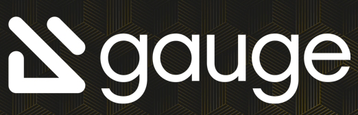

# Gauge

*summary*

**Gauge**是一个行为驱动开发（BDD）的UI测试框架，强调客户使用自然语言编写测试用例。

---

*2021.04.13*

### Gauge测试UI+Jenkins流水线+Mattermost消息订阅（Gauge篇）

其他两篇相关文章为

- [Gauge测试UI+Jenkins流水线+Mattermost消息订阅（Jenkins篇）]()

- [Gauge测试UI+Jenkins流水线+Mattermost消息订阅（Mattermost篇）]()

