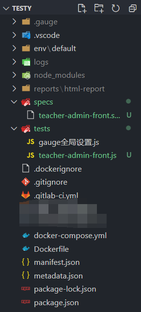

# Gauge

*summary*


**Gauge**是一个行为驱动开发（BDD）的UI测试框架，强调客户使用自然语言编写测试用例。

---

*2021.04.13*

### Gauge测试UI+Jenkins流水线+Mattermost消息订阅（Gauge篇）

其他两篇相关文章为

- [Gauge测试UI+Jenkins流水线+Mattermost消息订阅（Jenkins篇）](../运维%20DevOps/Jenkins.md/#gauge测试uijenkins流水线mattermost消息订阅jenkins篇)

- [Gauge测试UI+Jenkins流水线+Mattermost消息订阅（Mattermost篇）](../应用%20Application/Mattermost.md/#gauge测试uijenkins流水线mattermost消息订阅mattermost篇)

#### 在本地构建一个测试项目

- 一个简单的gauge项目大概长这样：

  
  
- spec规范：是由用自然语言编写的测试用例组成的测试组，每个测试用例根据测试场景分解为一些操作步骤。

  ```markdown
  # 某平台
  
  ## 管理员登录
  
  * 打开主页 "https://example.com"
  * 输入用户名 "admin_username"
  * 输入密码 "admin_password"
  * 点击登录按钮
  * 结果：显示面板（包含"管理面板"）
  ```
  
- js脚本：这里使用taiko库进行浏览器操作，对应了spec规范里的每个操作步骤

  ```js
  "use strict";
  const path = require('path');
  const {
      openBrowser,
      write,
      closeBrowser,
      goto,
      press,
      screenshot,
      above,
      click,
      checkBox,
      listItem,
      toLeftOf,
      link,
      text,
      into,
      textBox,
      evaluate
  } = require('taiko');
  const assert = require("assert");
  const headless = process.env.headless_chrome.toLowerCase() === 'true';
  
  step("打开主页 <url>",async(url)=>{
      await goto(url);
  })
  
  step("输入用户名 <username>",async(username)=>{
      await write(username,into(textBox("Username")));
  })
  step("输入密码 <password>",async(password)=>{
      await write(password,into(textBox("Password")));
  })
  step("点击登录按钮",async()=>{
      await press('Enter');
  })
  step("结果：显示面板（包含<adminText>）",async(adminText)=>{
      assert.ok(await text(adminText).exists(1000,5000));
  })
  ```

- 运行测试：`gauge run specs/`，这样会运行`specs/`文件夹下的所有spec规范的所有场景。

#### 制作Gauge的国内Docker镜像

> [Taiko+Gauge，官方DockerFile](https://github.com/getgauge/template-js/blob/master/Dockerfile)
>
> [Taiko In Docker](https://docs.taiko.dev/taiko_in_docker/#using-the-dockerfile)
>
> [Update Gauge/Taiko/node docker image](https://github.com/getgauge-contrib/gauge-docker/issues/3#issuecomment-472386420)
>
> [Failed to launch chrome! -While executing taiko in a docker container ](https://github.com/getgauge/taiko/issues/567)
>
> [docker apt-get 换源问题](https://www.cnblogs.com/ludada/articles/13839371.html)
>
> [使用docker run命令将参数传递给Dockerfile中的CMD(Use docker run command to pass arguments to CMD in Dockerfile)](https://www.it1352.com/647404.html)
>
> [shell中脚本参数传递的两种方式](https://blog.csdn.net/sinat_36521655/article/details/79296181)
>
> [如何向Docker容器传递参数](https://blog.csdn.net/chenxing109/article/details/85319489)
>
> [How to get the numeric exit status of an exited docker container?](https://stackoverflow.com/questions/46300610/how-to-get-the-numeric-exit-status-of-an-exited-docker-container)

- taiko官方提供了DockerFile，但遗憾的是，其中一些需要**科学**的操作没办法做到，于是我费尽周折改造了一番，自己制作了一个适用于国内的镜像。

- 步骤1：手动配置一个可用的gauge镜像**node-chromium**
  - `docker pull node`：拉取官方node镜像。
  
  - `docker run -dit node`：运行node容器
  
  - `docker exec -it 容器id bash`：进入node容器，接下来执行容器内操作
  
    - 下载vim工具：
  
        ```sh
        apt-get update
        apt-get -y install vim
        ```
        
    - 创建gauge目录，在其中预下载gauge的插件（html报告、js支持、chromium浏览器）和环境。这里就使用了淘宝npm镜像源加快速度
    
        ```sh
        mkdir /gauge
        cd /gauge
        npm install -g cnpm --registry=https://registry.npm.taobao.org
        cnpm install -g @getgauge/cli
        gauge install js
        gauge install screenshot
        gauge install html-report
        gauge config check_updates false
        ```
    
    - `vim /etc/locale.gen`：修改语言配置，使得容器支持中文显示
    
        ```sh
        ### 取消这两行注释
        :157 en_US.UTF-8 UTF-8
        :473 zh_CN.UTF-8 UTF-8
        ###
        ```
    
    - `locale-gen`：生成语言
    
    - `exit`：退出容器

  - `docker commit 容器id your_registry.com/node-chromium:latest`：提交容器改动，并打上tag
  
  - `docker login --username 账户 --password 密码 your_registry.com `：登录到远程镜像仓库
  
  - `docker push your_registry.com/node-chromium:latest`：上传到远程镜像仓库
  
- 步骤2：准备一个**entrypoint.sh**文件，将其**放于测试项目的根目录**，用来容器启动后自动运行gauge项目和输出测试结果。

  ```sh
  #!/bin/bash
  npm test
  result=$?
  echo "result=" $result
  
  if [ $result == "0" ];then
      exit 0
  else
      exit 1
  fi
  ```

  - 首先执行测试，将**命令的return值**（不是输出）赋值给`result`
  - 最后根据测试结果（0或1），使容器在退出时带有不同的状态码

- 步骤3：结合测试项目与taiko进一步加工成完整的**DockerFile**，现在将其**放于测试项目的根目录**，如果进行构建，就能将测试项目放入容器并可供运行。

  ```dockerfile
  FROM your_registry.com/node-chromium:latest
  
  ENV PATH /usr/local/lib:$PATH
  
  # 替换apt-get镜像源
  RUN sed -i "s@http://deb.debian.org@http://mirrors.tuna.tsinghua.edu.cn@g" /etc/apt/sources.list \
      && sed -i "s@http://security.debian.org@http://mirrors.tuna.tsinghua.edu.cn@g" /etc/apt/sources.list \
      && rm -Rf /var/lib/apt/lists/* \
      && rm -Rf /etc/apt/source.list.d/* \
      && apt-get clean
  
  # 使用中文语言和字体，并下载headless Chrome所需的依赖
  RUN apt-get update \
      && apt-get -y install locales \
      && apt-get -y  install ttf-wqy-microhei ttf-wqy-zenhei \
      && fc-cache -fv 
      && apt-get install -y git-all gconf-service libasound2 libatk1.0-0 libc6 libcairo2 libcups2 libdbus-1-3 \
      libexpat1 libfontconfig1 libgcc1 libgconf-2-4 libgdk-pixbuf2.0-0 libglib2.0-0 libgtk-3-0 \
      libnspr4 libpango-1.0-0 libpangocairo-1.0-0 libstdc++6 libx11-6 libx11-xcb1 libxcb1 libxcomposite1 \
      libxcursor1 libxdamage1 libxext6 libxfixes3 libxi6 libxrandr2 libxrender1 libxss1 libxtst6 ca-certificates \
      fonts-liberation libappindicator1 libnss3 lsb-release xdg-utils wget \
      && rm -rf /var/lib/apt/lists/*
  ENV LANG C.UTF-8
  ENV LC_ALL C.UTF-8
  
  # Add the Taiko browser arguments
  ENV TAIKO_BROWSER_ARGS=--no-sandbox,--start-maximized,--disable-dev-shm-usage
  ENV headless_chrome=true
  ENV TAIKO_SKIP_DOCUMENTATION=true
  
  # Uncomment the lines below to use chrome bundled with this image
  #ENV TAIKO_SKIP_CHROMIUM_DOWNLOAD=true
  #ENV TAIKO_BROWSER_PATH=/usr/bin/google-chrome
  
  # Set working directory
  WORKDIR /gauge
  
  # Copy the local working folder
  COPY . .
  
  # 已经有gauge和cnpm环境，这里是进行其他包的补充下载
  RUN cnpm install \
      && gauge install
  
  ENTRYPOINT ["./entrypoint.sh"]
  ```


  - 在项目的`package.json`中可以配置`npm test`所执行的脚本
  
    ```json
    {
      "name": "gauge-taiko-template",
      "description": "Starter template for writing JavaScript tests for Gauge",
      "scripts": {
        "test": "gauge run specs/"
      },
    }
    ```

#### 使用GitLab流水线构建镜像并推送至镜像仓库

- 因为上面最终的镜像（使用DockerFile构建的）会拷贝项目进去，所以每次项目发生更新时，我们也要重新构建一次镜像，这里就可以利用GitLab流水线来完成自动构建和推送操作。

  ```yaml
  stages:
    - build
  
  build: # 编译阶段
    stage: build
    script:
    	- chmod +x ./entrypoint.sh
      - docker build -t your_registry.com/gauge-taiko:master .
      - docker push your_registry.com/gauge-taiko:master
      - docker images
  ```
  
  - 可以用变量保护仓库的URL明文


