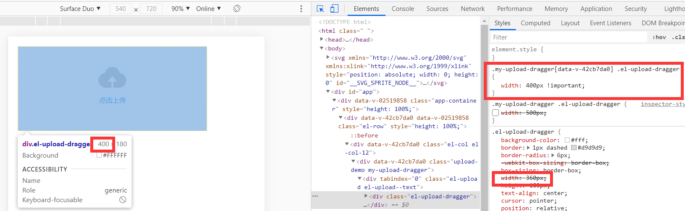
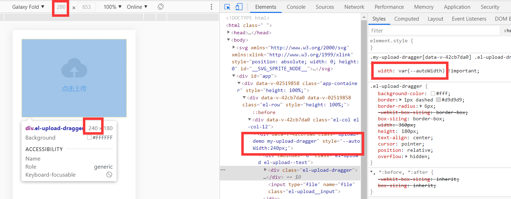
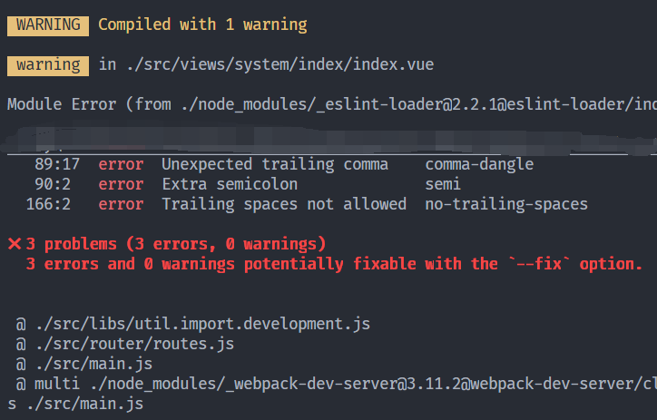
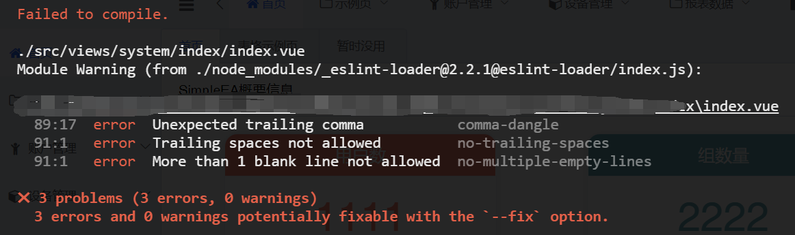

# Vue

*summary*


**Vue**是一个响应式前端框架。

---

*pinned*

### 单页面HTML模板（包括引入Element）

> [element-ui本地使用 - 534大熊猫 - 博客园 (cnblogs.com)](https://www.cnblogs.com/yph5233/p/12870251.html)

```html
<html>

<head>
  <link href="element.css" rel="stylesheet" type="text/css">
</head>

<body>
  <div id="app">
    <el-button @click="hello()">{{hey}}</el-button>
  </div>
</body>
<script language="javascript" src="vue.js"></script>
<script language="javascript" src="element.js"></script>
<script>
var Default=new Vue({
    el: '#app',
    data: {
        hey:"你好"
    },
    methods:{
        hello(){
            this.hey="嗨"
        }
    }
})

</script>

</html>
```

- vue.js和element.js分别去vue和element的官网寻找
- fonts文件（以2.13.1为例）下载地址：https://unpkg.com/browse/element-ui@2.13.1/lib/theme-chalk/fonts/
  - `.ttf`和`.woff`下载后放在单页面文件同级的`fonts`文件夹下

---

*2020.12.25*

### Vue的开发环境解决跨域请求问题

> [vue 跨域代理devServer的proxy打包后不生效](https://blog.csdn.net/jesion_t/article/details/105360625)
>
> [vue中解决跨域问题](https://www.cnblogs.com/ldlx-mars/p/7816316.html)

开发环境的localhost发起请求很容易产生跨域问题，因此Vue-cli提供一种简便的url代理工具，proxy可以在devServer中配置，以便不影响到生产环境。

- 位于`config/index.js`中，配置proxy：

  ```js
  module.exports = {
    devServer: {
      proxy: {
        '/api': {
          target: 'http://www.baidu.com', // 源地址 或 代理地址，这里设置的地址会代替axios中设置的baseURL
          changeOrigin: true, // 如果接口跨域，需要进行这个参数配置
          ws: true, // proxy websockets
          // pathRewrite方法重写url
          pathRewrite: {
            '^/api': '/'
            // pathRewrite: {'^/api': '/'} 重写之后url为 http://192.168.1.16:8085/xxxx
            // pathRewrite: {'^/api': '/api'} 重写之后url为 http://192.168.1.16:8085/api/xxxx
          }
        }
      }
    }
  }
  ```
  - 原本开发环境的请求是这样的：`http://localhost:8000 -> http://www.baidu.com/getData `
  - 现在可以进行这样的请求：`http://localhost:8000 -> http://localhost:8000/api/getData`，经过代理后变为`http://www.baidu.com -> http://www.baidu.com/getData`。既通过了跨域校验，也顺利请求到了接口

---

*2020.01.10*

### 获取窗口的尺寸从而做到组件样式响应式变化

当Vue页面需要显示在不同尺寸的移动端屏幕上时，一些固定尺寸的组件就会有不一致的表现效果。在使用element样式库时，有些组件还是贴心的给出了`:width`的参数，可以使用`:width:200`直接修改宽度；但有些组件就没有提供这种方法，比如文件拖动上传组件的尺寸是写死的360×180，并且无法通过改变父元素`upload-demo`的样式来修改内部样式：


而现在的一个需求就是想让这个组件的宽度**永远**填满页面。

#### 修改组件内部class的样式

> [修改element的内部样式的两种方式](https://www.cnblogs.com/sunshenggang/p/13343621.html)

- 首先在组件上添加自己的一个样式类

  ```vue
  <template>
  	<el-upload
          class="upload-demo my-upload-dragger"
          drag
     >
  </template>
  ```

- 然后用**组件穿透式**的方式去修改内部的class样式

  ```vue
  <style scoped>
  .my-upload-dragger >>> .el-upload-dragger{
    width:400px !important;
  }
  </style>
  ```

- 观察到宽度已经发生改变

  

#### 动态获取页面窗口宽度

> [基于element的网站自适应方案（移动端适配）](https://blog.csdn.net/qq_34295211/article/details/105513620)

```vue
<script>
	export default{
        methods:{
            getWidth(){
                return window.innerWidth; // 例：540
            }
        }
    }
</script>
```

#### 动态改变尺寸

> [vue动态样式绑定改变伪元素等特殊样式(css var函数)](https://blog.csdn.net/qq_43363884/article/details/104059654)
>
> [vue中动态style(如何动态修改伪元素样式)](https://blog.csdn.net/qq_44827891/article/details/106413564)

- 在css文件中可以使用变量

  - 使用`--`两根短划线开头来命名，大小写敏感：`--myVar: 100px`
  - 获取值时使用`var()`：`width: var(--myVar)`

- 动态在父元素（组件本身）的style中使用**方法**动态赋值**css变量**：

  ```vue
  <template>
  	<el-upload
          class="upload-demo my-upload-dragger"
          drag
          :style="{'--autoWidth':getWidth()}"
     >
  </template>
  <script>
  	export default{
          methods:{
              getWidth(){
                  var myWidth=window.innerWidth-20*2; //减去外部大面板的padding
                  return myWidth+'px'; // 例：500px
              }
          }
      }
  </script>
  ```

- 最后在样式中结合上面改变内部标签样式的方式使用变量：

  ```vue
  <style scoped>
  .my-upload-dragger >>> .el-upload-dragger{
    width:var(--autoWidth) !important;
  }
  </style>
  ```

- 得到的最终效果：

  

---

*2021.02.01*

### 上传文件动态 action

> 这个问题并未完全解决，以下草稿仅供参考，很可能有杂乱/缺失/错误等情况

> [Vue + Element el-upload 动态绑定 action 上传地址，上传地址更新不及时](https://blog.csdn.net/weixin_38886539/article/details/110180400)

---

*2021.03.06*

### 使用Store管理全局变量

> 这个问题并未完全解决，以下草稿仅供参考，很可能有杂乱/缺失/错误等情况

> [vuex管理全局变量、全局方法](https://www.jianshu.com/p/71baddb25147)

---

*2021.03.11*

### 如何强制检查ESlint



目前的状况是，会有error报错，但在`npm run dev`后变成了warning，并不会阻止程序的运行，这会导致还是有人偷懒不修复错误。于是想要在eslint检查不通过时直接运行失败。

#### 自动修复ESlint错误

> [eslint 保存自动修复_vscode下的eslint自动修复配置](https://blog.csdn.net/weixin_40001634/article/details/111813151)

- 在VS Code的`settings.json`中写入：

  ```json
  "editor.codeActionsOnSave": {
  	"source.fixAll.eslint": true
  }
  ```

#### 打开ESlint强制检查

> [vue-cli中eslint编译报错](https://blog.csdn.net/weixin_44692296/article/details/108572764)

- 在`vue.config.js`中写入：

  ```js
  module.exports = {
    devServer: {
      overlay: {
        warnings: true,
        error: true
      }
    },
    lintOnSave: 'error'
  }
  ```

- 可以看到编译错误被输出到了浏览器



### 覆盖element-ui的内部class样式

> [vue-cli3.0深度选择器/deep/编译报错](https://segmentfault.com/q/1010000020658004#)
>
> [vue加scoped后无法修改样式（无法修改element UI 样式）](https://blog.csdn.net/qq_42221334/article/details/88533329)
>
> [浅谈vue中style的scoped属性（修改特定Element组件样式的方法）](https://www.jianshu.com/p/9caf9e7aaca4)

- 需求是**能覆盖组件内部的类**同时**不能污染全局样式**

- 目前看到的解决办法有2种，对应不同的样式语言

- 第一种：SCSS样式，`::v-deep`和 `/deep/`都可以尝试一下

  ```vue
  <style lang="scss" scoped>
  .el-card{
    ::v-deep .el-card__header {
    width: 100%;
  }
  </style>
  ```
  
- 第二种：CSS样式，注意需要下载`vue-loader`且版本大于`12.2.0`

    ```vue
    <style scoped>
    .el-card >>> .el-card__header {
      width: 100%;
    }
    </style>
    ```

---

*2021.05.27*

### 使用vue-cli初始化项目

> [vue init webpack-simple与vue init webpack的区别_前端挖掘机-CSDN博客](https://blog.csdn.net/weixin_41849462/article/details/89361822)

- `npm install -g vue-cli`
- `vue init webpack your_project_name`
  - 这里`webpack`（适合中大型项目）也可以是`webpack-simple`（适合小型项目）

---

*2021.07.13*

### 压缩Vendor.js

> 这个问题并未完全解决，以下草稿仅供参考，很可能有杂乱/缺失/错误等情况

> [聊聊 webpack 打包如何压缩包文件大小 - Grewer - 博客园 (cnblogs.com)](https://www.cnblogs.com/Grewer/p/9033530.html)
>
> [vue项目打包之后 js文件太大的问题 - 烟雨轮回 - 博客园 (cnblogs.com)](https://www.cnblogs.com/cesarchen/p/13279686.html)
>
> [使用vue打包，vendor文件过大，或者是app.js文件很大 - wjw_Dream - 博客园 (cnblogs.com)](https://www.cnblogs.com/wjunwei/p/9242142.html)
>
> [Vue-cli 项目 打包 导致vendor js文件过大怎么处理？ - 中文 - Vue Forum (vuejs.org)](https://forum.vuejs.org/t/vue-cli-vendor-js/37246/2)
>
> [Vue打包导致 JS 很大的问题解决【完美解决】_小道仙的后宫-CSDN博客](https://blog.csdn.net/Tomwildboar/article/details/84175537)
>
> [前端性能优化之Gzip_赵天铭的博客-CSDN博客](https://blog.csdn.net/guzhao593/article/details/97498490)
>
> [k8s ingress-nginx自定义配置文件_yanggd1987的专栏-CSDN博客_ingress 配置文件](https://blog.csdn.net/yanggd1987/article/details/108284621)

#### Gzip压缩

##### 第一步：Vue项目Webpack在生产环境中打包生成.gz文件

- 安装`compression-webpack-plugin`

```bash
npm i -D compression-webpack-plugin
```

- 修改

```javascript
// 最好是先判断以下环境变量是否是生产环境的打包
const CompressionWebpackPlugin = require('compression-wepback-plugin')
if (process.env.NODE_ENV === 'production') {
    webpackConfig.plugins.push(
    	new CompressionWepbackPlugin({
            fllename: '[path].gz[query]',
            // 目标资源名称。 [file] 会被替换成原始资源。[path] 会被替换成原始资源的路径， [query] 会被替换成查询字符串。默认值是 "[path].gz[query]"。
            algorithm: 'gzip',
            // 算法，默认'gzip'
            test: '\\.(js|css))$',
            // 所有匹配该正则的资源都会被处理。默认值是全部资源。
            // 这里只匹配了js、css文件
            threshold: 10240,
          	//只有大小大于该值的资源会被处理。单位是 bytes。默认值是 0。
            minRatio: 0.8
            // 只有压缩率小于这个值的资源才会被处理。默认值是 0.8。
        })
    )
}
```

---

*2021.07.31*

### Linux下html的中文乱码

> [Linux中文显示乱码问题解决方法(编码查看及转换） - 整合侠 - 博客园 (cnblogs.com)](https://www.cnblogs.com/lizm166/p/12598731.html)
>
> [linux下html文件在浏览器中的显示乱码_weixin_33885676的博客-CSDN博客](https://blog.csdn.net/weixin_33885676/article/details/92987954)

- 安装中文语言支持：`yum -y groupinstall chinese-support`

- 设置中文字符集：

  ```sh
  >>> /etc/profile 最后添加
  export LANG="zh_CN.UTF-8"
  >>> shell
  . /etc/profile
  ```

- HTML中声明编码格式：

  ```html
  <meta http-equiv="Content-Type" content="text/html; charset=UTF-8" />
  ```


---

*2021.08.01*

### 让网页初步适配移动端浏览器尺寸

> [如何开发手机端网页，如何让网页自适应？_hahhahahaa的博客-CSDN博客_网页手机端自适应](https://blog.csdn.net/hahhahahaa/article/details/80901871)
>
> [移动端Web页面适配方案（整理版） - 简书 (jianshu.com)](https://www.jianshu.com/p/2c33921d5a68)
>
> [viewport 深入理解 | 菜鸟教程 (runoob.com)](https://www.runoob.com/w3cnote/viewport-deep-understanding.html)

- 在HTML的head中添加meta标签

  ```html
  <meta name="viewport" content="width=device-width,initial-scale=1.0,user-scalable: no,maximum-scale=1.0, minimum-scale=1.0"/>
  ```


---

*2021.08.02*

### el-select可搜索选择框在iOS上不弹出键盘

> [[Bug Report\] El-select component (remote or filterable) soft keyboard does not appear on Android devices · Issue #12563 · ElemeFE/element (github.com)](https://github.com/ElemeFE/element/issues/12563)

- element.js原代码：

- ```js
  readonly: function () { return !this.filterable || this.multiple || !(!h.a.prototype.$isServer && !isNaN(Number(document.documentMode))) && !(!h.a.prototype.$isServer && navigator.userAgent.indexOf("Edge") > -1) && !this.visible; }
  ```

- 替换为

- ```js
  readonly: function () { return !this.filterable || this.multiple || !(!h.a.prototype.$isServer && !isNaN(Number(document.documentMode))) && !(!h.a.prototype.$isServer && navigator.userAgent.indexOf("Edge") > -1) && !this.visible && !this.remote && !this.filterable; }
  ```

---

*2021.09.12*

### 为VS Code项目配置自动ESLint修复

- 在项目中下载依赖`eslint`：`npm install eslint`

- 在VS Code的`settings.json`中添加：

  ```json
  "eslint.alwaysShowStatus": true,
    // 每次保存时将代码按eslint格式进行保存
    "editor.codeActionsOnSave": {
      "source.fixAll.eslint": true
    },
    // 添加vue支持
  "eslint.validate": [
      "javascript",
      "vue",
      "html",
  ]
  ```

- 项目里同样要配置`.eslintrc.js`噢
- 重启VS Code
