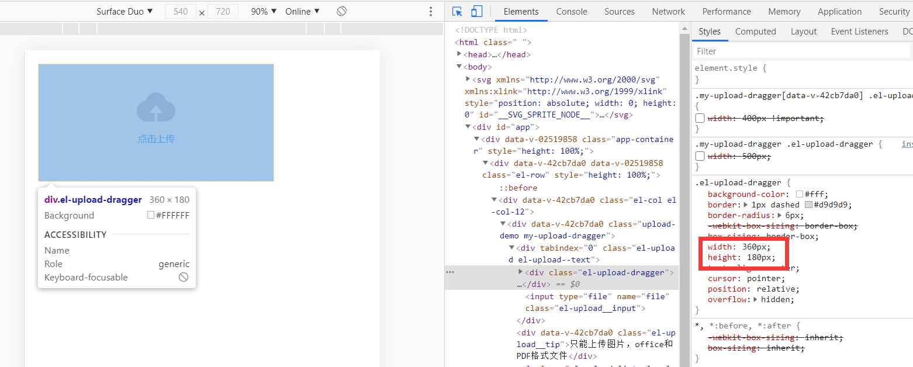

# Vue

*summary*


**Vue**是一个响应式前端框架。

---

*2020.12.25*

### Vue的开发环境解决跨域请求问题

> [vue 跨域代理devServer的proxy打包后不生效](https://blog.csdn.net/jesion_t/article/details/105360625)
>
> [vue中解决跨域问题](https://www.cnblogs.com/ldlx-mars/p/7816316.html)

开发环境的localhost发起请求很容易产生跨域问题，因此Vue-cli提供一种简便的url代理工具，proxy可以在devServer中配置，以便不影响到生产环境。

- 位于`config/index.js`中，配置proxy：

  ```js
  module.exports = {
    devServer: {
      proxy: {
        '/api': {
          target: 'http://www.baidu.com', // 源地址 或 代理地址，这里设置的地址会代替axios中设置的baseURL
          changeOrigin: true, // 如果接口跨域，需要进行这个参数配置
          ws: true, // proxy websockets
          // pathRewrite方法重写url
          pathRewrite: {
            '^/api': '/'
            // pathRewrite: {'^/api': '/'} 重写之后url为 http://192.168.1.16:8085/xxxx
            // pathRewrite: {'^/api': '/api'} 重写之后url为 http://192.168.1.16:8085/api/xxxx
          }
        }
      }
    }
  }
  ```
  - 原本开发环境的请求是这样的：`http://localhost:8000 -> http://www.baidu.com/getData `
  - 现在可以进行这样的请求：`http://localhost:8000 -> http://localhost:8000/api/getData`，经过代理后变为`http://www.baidu.com -> http://www.baidu.com/getData`。既通过了跨域校验，也顺利请求到了接口

---

*2020.01.10*

### 获取窗口的尺寸从而做到组件样式响应式变化

当Vue页面需要显示在不同尺寸的移动端屏幕上时，一些固定尺寸的组件就会有不一致的表现效果。在使用element样式库时，有些组件还是贴心的给出了`:width`的参数，可以使用`:width:200`直接修改宽度；但有些组件就没有提供这种方法，比如文件拖动上传组件的尺寸是写死的360×180，并且无法通过改变父元素`upload-demo`的样式来修改内部样式：



而现在的一个需求就是想让这个组件的宽度**永远**填满页面。

#### 修改组件内部class的样式

> [修改element的内部样式的两种方式](https://www.cnblogs.com/sunshenggang/p/13343621.html)

- 首先在组件上添加自己的一个样式类

  ```vue
  <template>
  	<el-upload
          class="upload-demo my-upload-dragger"
          drag
     >
  </template>
  ```

- 然后用**组件穿透式**的方式去修改内部的class样式

  ```vue
  <style scoped>
  .my-upload-dragger >>> .el-upload-dragger{
    width:400px !important;
  }
  </style>
  ```

- 观察到宽度已经发生改变

  

#### 动态获取页面窗口宽度

> [基于element的网站自适应方案（移动端适配）](https://blog.csdn.net/qq_34295211/article/details/105513620)

```vue
<script>
	export default{
        methods:{
            getWidth(){
                return window.innerWidth; // 例：540
            }
        }
    }
</script>
```

#### 动态改变尺寸

> [vue动态样式绑定改变伪元素等特殊样式(css var函数)](https://blog.csdn.net/qq_43363884/article/details/104059654)
>
> [vue中动态style(如何动态修改伪元素样式)](https://blog.csdn.net/qq_44827891/article/details/106413564)

- 在css文件中可以使用变量

  - 使用`--`两根短划线开头来命名，大小写敏感：`--myVar: 100px`
  - 获取值时使用`var()`：`width: var(--myVar)`

- 动态在父元素（组件本身）的style中使用**方法**动态赋值**css变量**：

  ```vue
  <template>
  	<el-upload
          class="upload-demo my-upload-dragger"
          drag
          :style="{'--autoWidth':getWidth()}"
     >
  </template>
  <script>
  	export default{
          methods:{
              getWidth(){
                  var myWidth=window.innerWidth-20*2; //减去外部大面板的padding
                  return myWidth+'px'; // 例：500px
              }
          }
      }
  </script>
  ```

- 最后在样式中结合上面改变内部标签样式的方式使用变量：

  ```vue
  <style scoped>
  .my-upload-dragger >>> .el-upload-dragger{
    width:var(--autoWidth) !important;
  }
  </style>
  ```

- 得到的最终效果：

  

---

*2021.02.01*

### 上传文件动态 action

> 这个问题并未完全解决，以下草稿仅供参考，很可能有杂乱/缺失/错误等情况

> [Vue + Element el-upload 动态绑定 action 上传地址，上传地址更新不及时](https://blog.csdn.net/weixin_38886539/article/details/110180400)

---

*2021.03.06*

### 使用Store管理全局变量

> 这个问题并未完全解决，以下草稿仅供参考，很可能有杂乱/缺失/错误等情况

> [vuex管理全局变量、全局方法](https://www.jianshu.com/p/71baddb25147)

---

*2021.03.11*

### 如何强制检查ESlint


目前的状况是，会有error报错，但在`npm run dev`后变成了warning，并不会阻止程序的运行，这会导致还是有人偷懒不修复错误。于是想要在eslint检查不通过时直接运行失败。

#### 自动修复ESlint错误

> [eslint 保存自动修复_vscode下的eslint自动修复配置](https://blog.csdn.net/weixin_40001634/article/details/111813151)

- 在VS Code的`settings.json`中写入：

  ```json
  "editor.codeActionsOnSave": {
  	"source.fixAll.eslint": true
  }
  ```

#### 打开ESlint强制检查

> [vue-cli中eslint编译报错](https://blog.csdn.net/weixin_44692296/article/details/108572764)

- 在`vue.config.js`中写入：

  ```js
  module.exports = {
    devServer: {
      overlay: {
        warnings: true,
        error: true
      }
    },
    lintOnSave: 'error'
  }
  ```

- 可以看到编译错误被输出到了浏览器


### 覆盖element-ui的内部class样式

> [vue-cli3.0深度选择器/deep/编译报错](https://segmentfault.com/q/1010000020658004#)
>
> [vue加scoped后无法修改样式（无法修改element UI 样式）](https://blog.csdn.net/qq_42221334/article/details/88533329)
>
> [浅谈vue中style的scoped属性（修改特定Element组件样式的方法）](https://www.jianshu.com/p/9caf9e7aaca4)

- 需求是**能覆盖组件内部的类**同时**不能污染全局样式**

- 目前看到的解决办法有2种，对应不同的样式语言

- 第一种：SCSS样式，`::v-deep`和 `/deep/`都可以尝试一下

  ```vue
  <style lang="scss" scoped>
  .el-card{
    ::v-deep .el-card__header {
    width: 100%;
  }
  </style>
  ```
  
- 第二种：CSS样式，注意需要下载`vue-loader`且版本大于`12.2.0`

    ```vue
    <style scoped>
    .el-card >>> .el-card__header {
      width: 100%;
    }
    </style>
    ```

---

*2021.05.27*

### 使用vue-cli初始化项目

> [vue init webpack-simple与vue init webpack的区别_前端挖掘机-CSDN博客](https://blog.csdn.net/weixin_41849462/article/details/89361822)

- `npm install -g vue-cli`
- `vue init webpack your_project_name`
  - 这里`webpack`（适合中大型项目）也可以是`webpack-simple`（适合小型项目）

