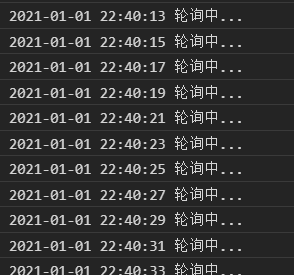
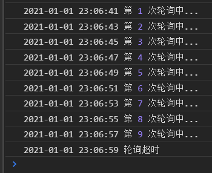
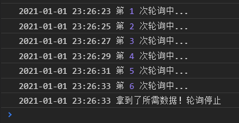

# 微信小程序

*summary*


**微信小程序**的开发需要了解MINA框架，这是由微信官方开创的一套和Vue写法极其类似的前端框架，专门为微信小程序而生。

- 必须下载**微信开发者工具**以预览代码效果。如果不需要编译错误提示，可以选用**VSCode**来敲代码，因为这样可以利用一些插件。

---

*2020.12.23*

### 使用插件minapp时，格式化改用prettier

这是在VSCode写代码的时候产生的念头，主要是因为minapp默认的wxml格式化工具对超长的元素视而不见。既然插件也提供了prettier的工具，那就抱着试试看的心理尝试了一下，效果还不错。注意`"parser":"html"`不加上的话，prettier格式化会报错。

- 在`settings.json`中添加配置：

  ```json
  {
      "minapp-vscode.wxmlFormatter": "prettier",
      "minapp-vscode.prettier": {
          "parser":"html",
          "useTabs": false,
          "tabWidth": 2,
          "printWidth": 100,
          "singleQuote": false
      }
  }
  ```

### WXS语法知识1

#### 正则截取字符串

```javascript
var str='http://abc.com/a?id=B'
var code= str.match(/\?id=(.*)/)[1] //取?id=后面所有字符串
console.log(code) //B
```

#### 用that取代this关键字

``` javascript
someMethod(){
    var that=this
    wx.request({
        data:that.data.val //如果这里用this，指向的是wx.request（缩小了范围）
        ...
    })
}
```

---

*2020.12.29*

### 保留两位小数（补零）

- wxml无法执行js的方法，因此还是得wxs处理后再由wxml显示。

  ```js
  var a=1.2
  a.toFixed(2)//1.20 注意返回的是String类型
  ```

### setData的浅拷贝

- setData虽然能对当前页面的data进行赋值，但它实际上json对象的赋值是引用式的（**浅拷贝**），这会造成赋值来源可能会受到更改。

  ```js
  var global={
      a:1
  }
  this.setData({
      localData:global
  })
  console.log(global) //{a:1}
  this.setData({
      [`localData.a`]:2
  })
  console.log(global) //{a:2}
  ```

  - 这样如果`global`刚刚好是全局变量，那么其他页面下次再次引用全局变量时，值就会不一致。

- 一种方法是**深拷贝取代浅拷贝**，由于json内部成员的类型也比较简单，所以可以直接用一行简单命令：

  ```json
  var newCopy=JSON.parse(JSON.stringify(data));
  ```

  - > [关于JSON.parse(JSON.stringify(obj))实现深拷贝应该注意的坑](https://www.jianshu.com/p/b084dfaad501)

---

*2020.12.30*

### 微信支付实现

> [官方微信支付文档](https://developers.weixin.qq.com/miniprogram/dev/api/open-api/payment/wx.requestPayment.html)
>
> [java 后台微信小程序统一下单支付、以及二次签名（亲测可用）](https://blog.csdn.net/weixin_44901065/article/details/89888037)

#### 准备工作

- 调用前需在[小程序微信公众平台](https://mp.weixin.qq.com/) -功能-微信支付入口申请接入微信支付

  - 微信商户号**mch_id**
  - API密钥**api_secret**

- 准备一个支付界面`/payment`
  - 有一个可以点击的支付按钮`<button>支付订单</button>`

  - 能接收上个页面传进来的订单值`orderInfo`

    - > [微信小程序——详细讲解页面传值(多种方法)](https://www.cnblogs.com/bushui/p/11633766.html)

- 选择支付接口版本。`v3`和旧版本`v2`的鉴权方式和请求参数都有很大区别，但最重要的是，截止到2020.12.31，`v2`版本提供更多接口功能，包括退款等。因此下面介绍的是`v2`版本的微信支付接口。
  
- `v2`版本的demo下载地址：[SDK与DEMO下载](https://pay.weixin.qq.com/wiki/doc/api/native.php?chapter=11_1)和文档目录：[业务流程](https://pay.weixin.qq.com/wiki/doc/api/wxa/wxa_api.php?chapter=7_4&index=3)
  
- 需要的pom依赖：

  ```xml
  <dependency>
      <groupId>xpp3</groupId>
      <artifactId>xpp3_min</artifactId>
      <version>1.1.4c</version>
  </dependency>
  <dependency>
      <groupId>com.thoughtworks.xstream</groupId>
      <artifactId>xstream</artifactId>
      <version>1.4.10</version>
  </dependency>
  ```

  

#### 步骤1：签名，IP等业务无关参数的生成

- 接口中包含一些与业务本身无关的参数，这些参数的生成过程是比较复杂的，很多可以引用DEMO里的方法。在后续的代码中会展示如何使用DEMO的工具类。

- 随机字符串`nonceStr`：只要是32位以内的，由数字和字母组成的随机字符串即可。

  >  [java中随机生成字符串的方法（三种）](https://www.cnblogs.com/jpfss/p/9772019.html)

- 签名`sign`：官方的[签名算法](https://pay.weixin.qq.com/wiki/doc/api/wxa/wxa_api.php?chapter=4_3)文档。

  - 将发送的数据中**除去签名字段**、**参数值非空**的参数名**按照ASCII码从小到大字典序**排序，拼接成`key1=value1&key2=value2`的字符串stringA
  - 在stringA的最后拼接上`&key=`+API密钥**api_secret**，得到stringTemp
  - 对stringTemp进行MD5运算，得到signMD5
  - 将signMD5所有字符大写，得到最终sign值

- 机器IP`spbill_create_ip`：直接人工填写是最快的，当然动态获取也可以（注意反向代理、局域网等）

- 时间戳`timestamp`：注意服务器时区是否正确

#### 步骤2：统一下单，获取预支付ID

第一步是要创建预支付交易单

- 在后端创建一个**生成预支付交易单**的接口，如`Res createWxOrder(Req entity)`

  - entity的结构至少包含：

    ```json
    {
        orderId:"1",
        openid:"2"
    }
    ```

  - 接口内的实现，使用官方的DEMO方法会变得异常简单：

    ```java
    @Override
    public Map<String,Object> createWxOrder(WxOrderParam entity) throws Exception {
        String orderURL="https://api.mch.weixin.qq.com/pay/unifiedorder";
        Map<String,String> order=new HashMap<>();
        order.put("appid",appId);
        order.put("mch_id",merchantId);
        order.put("nonce_str",WXPayUtil.generateNonceStr());
        order.put("body","xxxx-xx");
        order.put("out_trade_no",entity.getOrderId());
        order.put("total_fee","1");
        order.put("spbill_create_ip", getLocalIp());
        order.put("notify_url","nonono");//onnononono 回调地址
        order.put("trade_type","JSAPI");
        //调用微信支付api接口（带有签名）{统一下单}
        String orderXml=WXPayUtil.generateSignedXml(order,apiSecret);
        String resXml=HttpUtil.postWithXml(orderURL,orderXml,"utf-8");
    
        //接收微信支付接口{统一下单}的返回数据
        XStream xs = new XStream();
        XStream.setupDefaultSecurity(xs);
        xs.allowTypes(new Class[]{WxPayOrderInfoRes.class});
        xs.alias("xml", WxPayOrderInfoRes.class);
        WxPayOrderInfoRes returnInfo = (WxPayOrderInfoRes)xs.fromXML(resXml);
        //二次签名
        ....
    }
    ```

- 微信支付后台接收到这个预付单后，会返回一个非常重要的**预支付交易会话标识**`prepay_id`，用于后续接口调用，2小时内过期。

- 如果发生异常，则会返回异常码等。

#### 步骤3：二次签名，用于wx.requestPayment鉴权

- 上面我们拿到了标识还不能急着返回，我们需要结合返回的数据再次生成签名，然后才能返回给小程序。因为wx.requestPayment需要后端提供几个重要的参数用于接口鉴权。

- 生成签名的方法与之前类似：

  ```java
  @Override
  public Map<String,Object> createWxOrder(WxOrderParam entity) throws Exception {
      //统一下单
      //...
      //二次签名
      Map<String,Object> payInfo = new HashMap<>();
      if ("SUCCESS".equals(returnInfo.getReturn_code()) && "SUCCESS".equals(returnInfo.getResult_code())) {
          long time = System.currentTimeMillis()/1000;
          //生成签名（官方给出来的签名方法）
          Map<String,String> map2 = new HashMap<>();
          map2.put("appId", appId);
          map2.put("timeStamp", String.valueOf(time));
          //这边的随机字符串必须是第一次生成sign时，微信返回的随机字符串，不然小程序支付时会报签名错误
          map2.put("nonceStr", returnInfo.getNonce_str());
          map2.put("package", "prepay_id=" + returnInfo.getPrepay_id());
          map2.put("signType", "MD5");
  
          String sign2 = WXPayUtil.generateSignature(map2, apiSecret);
          //无效的签名方法
          //String sign1 = Signature.getSign(signInfo);
          payInfo.put("timeStamp", String.valueOf(time));
          payInfo.put("nonceStr", returnInfo.getNonce_str());
          payInfo.put("prepay_id","prepay_id=" + returnInfo.getPrepay_id());
          payInfo.put("signType", "MD5");
          payInfo.put("paySign", sign2);
      }
      else
      {
          payInfo.put("errorBody", resXml);
      }
      return payInfo;
  }
  ```

#### 步骤4：小程序调出支付弹窗，输入密码支付订单

- 小程序端应该先同步调用服务端的生成订单，然后等到那些鉴权参数返回后，调用wx.requestPayment发起支付。

  ```js
  wx.request({
      url: app.globalData.ServerHost+'dealer/mina/createWxOrder',
      data: {
          openid:app.globalData.openid,
          orderId:"icytest"+Math.random().toString(16).substr(2, 8),
      },
      header: {'content-type':'application/json'},
      method: 'POST',
      dataType: 'json',
      success: (result)=>{
          console.log('统一下单:',result)
          wx.requestPayment({
              timeStamp: result.data.timeStamp,
              nonceStr: result.data.nonceStr,
              package: result.data.prepay_id,
              signType:result.data.signType,
              paySign: result.data.paySign,
              success: (result)=>{
                  console.log('发起微信支付：',result)
              },
              fail: ()=>{},
              complete: ()=>{}
          });
      },
      fail: ()=>{},
      complete: ()=>{}
  });
  ```

  

#### 步骤5：支付完成，服务端接受回调通知

- 微信在处理完支付订单后，会调用先前`notify_url`传递的接口。

- 这个回调接口我们需要：
  - 接收xml报文，并验证是否返回SUCCESS。
  - 验证签名及订单金额和实付金额。
  - 处理支付完毕后的业务逻辑
  - 通知微信平台已经成功收到

- 可能会多次重复通知，要做好能处理重复消息的准备。

- 使用流数据的方式来传输。

  ```java
  @Override
  public void notifyWxPayment(HttpServletRequest request, HttpServletResponse response) throws Exception {
      BufferedReader br = new BufferedReader(new InputStreamReader(request.getInputStream()));
      String line;
      StringBuilder sb = new StringBuilder();
      while((line = br.readLine()) != null){
          sb.append(line);
      }
      br.close();
      //sb为微信返回的xml
      String notityXml = sb.toString();
      String resXml = "";
      System.out.println("{微信支付完成回调}接收到的报文：" + notityXml);
  
      Map<String, String> map = WXPayUtil.xmlToMap(notityXml);
  
      String returnCode = map.get("return_code");
      if("SUCCESS".equals(returnCode)){
          //验证签名是否正确
          Map<String, String> validParams = PayUtil.paraFilter(map);  //回调验签时需要去除sign和空值参数
          //把数组所有元素，按照“参数=参数值”的模式用“&”字符拼接成字符串
          String validStr = PayUtil.createLinkString(validParams);
          //拼装生成服务器端验证的签名
          String sign = PayUtil.sign(validStr, Configure.getKey(), "utf-8").toUpperCase();
          // 当第一次回调成功了,那么我们就不再执行逻辑了
          
          //根据微信官网的介绍，此处不仅对回调的参数进行验签，还需要对返回的金额与系统订单的金额进行比对等
          if(sign.equals(map.get("sign"))){
  			System.out.println("我执行我的业务逻辑");
              //通知微信服务器已经支付成功
              resXml = "<xml>" + "<return_code><![CDATA[SUCCESS]]></return_code>"
                  + "<return_msg><![CDATA[OK]]></return_msg>" + "</xml>";
          } else {
              System.out.println("微信支付回调失败!签名不一致");
          }
      }else{
          resXml = "<xml>" + "<return_code><![CDATA[FAIL]]></return_code>"
              + "<return_msg><![CDATA[报文为空]]></return_msg>" + "</xml>";
      }
  
      BufferedOutputStream out = new BufferedOutputStream(response.getOutputStream());
      out.write(resXml.getBytes());
      out.flush();
      out.close();
  }
  ```

#### 步骤6：小程序获取支付成功通知解决方案

- 官方实现参考：[支付回调和查单实现指引](https://pay.weixin.qq.com/wiki/doc/api/wxa/wxa_api.php?chapter=23_9&index=1#menu2.1)

#### 坑：签名错误

> [微信支付签名错误](https://developers.weixin.qq.com/community/develop/doc/000ecef79b44108fd687aa9eb5b000)

- 签名错误的时候可以先去[微信支付接口签名校验工具](https://pay.weixin.qq.com/wiki/doc/api/jsapi.php?chapter=20_1)校验一下。可能是**签名算法错误**了。
- 有可能是**body里包含中文**，没有处理好。排查这个的方法是不用中文body就能通过签名验证。解决办法是：

```java
httpPost.setHeader("Content-type", "text/xml;charset=utf-8");
```

- 有可能是API密钥**api_secret错误**，需要重置。

---

*2021.1.1*

### 轮询接口实现

> [小程序中setTimeout轮询判断数据更新后跳转](http://willless.com/settimeout-polling-in-applet-to-judge-data-jump-after-updating.html)
>
> 存一个可能有用的另一种写法：[小程序如何用长轮询，来实现户端实时刷新](https://www.cnblogs.com/xuhuang/p/11820814.html)

- 有些时候小程序调用的接口仅仅是作服务端的唤起工作，实际的返回数据需要另外请求。也就是在后端上，该接口是**异步非阻塞**的，这个时候小程序需要不断向另外的接口发起请求，确认数据是否更新。这里就涉及一个轮询的实现方式。

- 首先要如何进行**定时循环调用**呢？具体的需求其实无非就是以下几点：
  - 发起了请求，没有获取到想要的数据：需要在**几秒后**再次发起同一个请求。
  - 发起了请求，获取到了想要的数据：拿走数据，轮询结束。
  - 发起了请求，没有获取到想要的数据，而且已经请求了太多次，判定超时：轮询结束。
  
- 那么先从定时讲起，使用的是超时调用`timeout`。
  
  - > 轮询不使用间歇调用`interval`的原因：[setInterval()与setTimeout()计时器](https://www.cnblogs.com/lengyuehuahun/p/5650030.html)
    
  - 使用`setTimeout()`来延时执行，下面的代码设置了2s的定时器，会在2s后再执行输出。注意这句代码实际的效果是让函数在2s后再进入JavaScript的程序执行队列（这也使得每次请求都是有序的），因此**不会阻塞**后面的代码。
  
    ```js
    let time = setTimeout(()=>{
        console.log("轮询中...")
    }, 2000)
    ```
  
  - 使用`clearTimeout()`来取消定时器，可以让准备延时执行的定时器失效。
  
    ```js
    clearTimeout(time)
    ```
  
- 但这样只会执行一次，于是我们就用“套娃”的形式让超时调用不断进行。

  ```js
  myUpdate(){
      setTimeout(this.myUpdate,2000)
      console.log(util.formatTime(new Date()),'轮询中...')
  },
  startWaiting(){
      setTimeout(this.myUpdate,2000)
  }
  ```

  - 执行`startWaiting()`，可以看到如下结果

    

- 每隔2秒成功执行了所需的方法！但是现在轮询不会停止，因此可以设置一个**超时**变量控制次数，这样整个轮询过程的超时时间就是*超时时间=轮询间隔×超时次数*。更新上面的代码：

  ```js
  data:{
      waitTimes:0,//超时变量
  },
  myUpdate() {
      var maxWait = 10 //超时次数
      var newWait = this.data.waitTimes + 1 //执行的次数
      if (newWait >= maxWait) { //超时了
          console.log(util.formatTime(new Date()), '轮询超时')
      } else { //未超时
          setTimeout(this.myUpdate, 2000)
          console.log(util.formatTime(new Date()), '第', newWait, '次轮询中...')
          this.setData({
              waitTimes: newWait
          })
      }
  },
  startWaiting() {
      setTimeout(this.myUpdate, 2000)
  }
  ```

  - 现在的效果为

    

- 但并非所有时候都会完整地执行轮询方法，如果**某一次轮询拿到了数据**或者**用户退出了当前页面**，都会导致整个轮询立刻终止，且不再进行下一次轮询。这就需要马上清除准备执行的定时器，因此我们需要做更大的改动，这里假设第6次轮询拿到了数据：

  ```js
  myUpdate() {
      var maxWait = 10 //超时次数
      var newWait = this.data.waitTimes + 1 //执行的次数
      if (newWait >= maxWait) { //超时了
          console.log(util.formatTime(new Date()), '轮询超时')
      } else { //未超时
          var time = setTimeout(this.myUpdate, 2000)
          this.data.timeList.push(time) // 存储定时器
          console.log(util.formatTime(new Date()), '第', newWait, '次轮询中...')
          if (newWait === 6) { //拿到数据，轮询终止
              console.log(util.formatTime(new Date()), '拿到了所需数据！轮询停止')
              this.stopWaiting()
          } else { //继续轮询
              this.setData({
                  waitTimes: newWait
              })
          }
      }
  },
  startWaiting() {
      setTimeout(this.myUpdate, 2000)
  },
  stopWaiting() {
      for (var i = 0; i < this.data.timeList.length; i++) {
          clearTimeout(this.data.timeList[i]); //清除了所有定时器
      }
  }
  ```

  - 效果如下：

  

- 最后的问题是，如何监听用户离开了当前页面？可以使用生命周期函数

  ```js
  /**
   * 生命周期函数--监听页面隐藏
   */
  // 点击系统Home键返回上一步时候触发
  onHide: function () {
    this.stopWaiting()
  },

  /**
   * 生命周期函数--监听页面卸载
   */
  // 点击左上角返回箭头时候触发
  onUnload: function () {
    this.stopWaiting()
  },
  ```

  