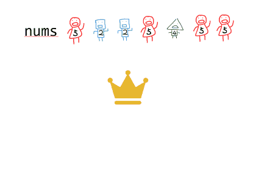

# Easy

*summary*

**Easy**是简单题，这里涵盖一些基本的操作和容易粗心的小错误

---

*pinned*

TODO

- 蓄水池抽样：[497. 非重叠矩形中的随机点 - 力扣（LeetCode） (leetcode-cn.com)](https://leetcode-cn.com/problems/random-point-in-non-overlapping-rectangles/)
- 多线程防死锁：[1226. 哲学家进餐 - 力扣（LeetCode） (leetcode-cn.com)](https://leetcode-cn.com/problems/the-dining-philosophers/)

### 常见技巧

- 赞美C++17吧！BFS再也不用自己写结构体

  ```cpp
  queue<tuple<int, int, bool>> q;
  q.emplace(0, 0, false);
  while(!q.empty()){
      auto [y, t, f] = q.front();
      q.pop();
      //something...
      if(!f && !S.count(yy) && yy>=0) 
          q.emplace(yy, t+1, true); // 新位置入队，标记为向后
  }
  return -1;
  
  作者：nbgao
  链接：https://leetcode-cn.com/problems/minimum-jumps-to-reach-home/solution/nbgao-1654-dao-jia-de-zui-shao-tiao-yue-9nio6/
  来源：力扣（LeetCode）
  著作权归作者所有。商业转载请联系作者获得授权，非商业转载请注明出处。
  ```

  

- C++的最小值写法：`int ans = min({ a, b});`

- map可以使用upper_bound等来寻找大于等于target的第一个元素，涉及插入时排序和在有序数组中查找时可以借用map

- C++ string与int互转

  ```cpp
  to_string(1);
  //-------------
  s="1"
  atoi(s.c_str());
  ```

- 句子中按空格分割单词时，可以预先在string最后加一个空格，这样可以避免最后一个单词因为没有空格在后面而没有处理。

  - 或者需要邻位的信息时（如和前一位字符相邻），在string前/后可以加一个特殊符号

- 复杂类型数组自定义排序（使用sort+匿名函数）：

  ```cpp
  class Solution {
  public:
      vector<string> reorderLogFiles(vector<string>& logs) {
          auto func = [](const string& str)->string
          {
              auto pos = str.find(' ');
              if(isalpha(str.at(pos + 1))) 
                  return "0" + str.substr(pos) + str.substr(0, pos);
              return "1";
          };
  
          auto cmp = [=](const string& str1, const string& str2)
          { 
              return func(str1) < func(str2);
          };
  
          stable_sort(logs.begin(), logs.end(), cmp);
          return logs;
      }
  };
  
  作者：you-yuan-de-cang-qiong
  链接：https://leetcode-cn.com/problems/reorder-data-in-log-files/solution/c-stable_sort-by-you-yuan-de-cang-qiong-ujob/
  来源：力扣（LeetCode）
  著作权归作者所有。商业转载请联系作者获得授权，非商业转载请注明出处。
  ```

  ```cpp
  // start = 0 表示偶数下标，start = 1 表示奇数下标
  // 返回值为最大键，最大键对应的值，次大键，次大键对应的值
  auto get = [&](int start) -> tuple<int, int, int, int> {
      unordered_map<int, int> freq;
      for (int i = start; i < n; i += 2) {
          ++freq[nums[i]];
      }
  
      int fstkey = 0, fstval = 0, sndkey = 0, sndval = 0;
      for (const auto& [key, val]: freq) {
          if (val > fstval) {
              tie(sndkey, sndval) = tuple{fstkey, fstval};
              tie(fstkey, fstval) = tuple{key, val};
          }
          else if (val > sndval) {
              tie(sndkey, sndval) = tuple{key, val};
          }
      }
  
      return {fstkey, fstval, sndkey, sndval};
  };
  
  auto [e1stkey, e1stval, e2ndkey, e2ndval] = get(0);
  auto [o1stkey, o1stval, o2ndkey, o2ndval] = get(1);
  ```

  

  ```cpp
  //先按second升序，再按first降序
  vector<pair<int, int>> temp;
  sort(temp.begin(), temp.end(), [](const auto &a, const auto &b)
       {
           if (a.second < b.second)
               return true;
           else if (a.second == b.second)
               return a.first > b.first;
           else return false;
       });
  ```

- 环形字符串找子串：将环形字符串写两遍，`HISabT => HISabTHISabT`，`THIS`就出现了

- A和B看作一个整体

  - [884. 两句话中的不常见单词](https://leetcode-cn.com/problems/uncommon-words-from-two-sentences/)：在一句话中出现一次，另一句话中不出现 => 两句话中恰好出现一次
  - [1768. 交替合并字符串](https://leetcode-cn.com/problems/merge-strings-alternately/)：交替打印两个字符串中的字符 => 一次循环中，打印A字符串一次+打印B字符串一次

- 进制转换别忘记0。`if(num==0) return "0";`

- 2整除用位运算简洁高效：`int mid = ( L + R ) >> 1`

- 周围八格的邻居：`neighbors[3]{-1,0,1}`，然后双循环，靠i和j的9种组合就能实现9种方向。

- `for(auto& a:array)`比`for(auto a:array)`快好几倍

- 算术溢出格式转换：

  ```cpp
  int num = 1;
  long long res = num - 1;
  ```

  - 此时num先和1在4字节上计算减法，然后转为8字节，有溢出风险。应该提前转化成高字节减法，方法是把所有操作数转为高字节

    ```cpp
    int num = 1;
    long long res = (long long)num - 1;
    ```


---

*2021.07.16*

### 989.数组形式的整数加法

> [989. 数组形式的整数加法 - 力扣（LeetCode） (leetcode-cn.com)](https://leetcode-cn.com/problems/add-to-array-form-of-integer/)

粗心点

- 逢10进位：判断条件应该是`>=10`而不是`>10`
- 想提前结束节省步骤：加数`k`归零不代表进位结束，比如`[9999]+1`。
- 情况没考虑全：之前只想到扩充**一次**数组（留给进位），但可能出现**多次**扩充数组的情况，比如`[0]+23`

---

*2021.07.19*

### Boyer-Moore 投票算法

> [面试题 17.10. 主要元素 - 力扣（LeetCode） (leetcode-cn.com)](https://leetcode-cn.com/problems/find-majority-element-lcci/)

- 寻找数组中个数超过半数的元素
  - 关键点：他的个数超过了其他所有元素个数之和。因此可以想到即使其他所有元素联合起来，也打不过这个主要元素。
- 时间复杂度：$O(N)$。空间复杂度：$O(1)$。
- 把每个元素看作一个帮派成员，战斗机制是：
  - 如果当前元素和当前帮派相同，那么加入帮派，使其人数+1。
  - 如果当前元素和当前帮派不同，那么会消灭一个帮派成员，使其人数-1。
    - 如果帮派被消灭了，当前的挑战者成立新的帮派，人数为1。
- 活到最后的帮派要再经历一次考验，重新扫描数组检查是否真的是主要元素。



---

*2021.07.20*

### 最大公约数(GCD)

> [C++求最大公约数 - 世子抱瑜玉 - 博客园 (cnblogs.com)](https://www.cnblogs.com/ziyuwang/p/10391037.html)
>
> [求最大公约数的4种算法（C++）_Elf.筱焱的博客-CSDN博客_最大公约数算法](https://blog.csdn.net/qq_42302831/article/details/88587052)

- 辗转相除法：
  - 先确定大数和小数
  - 如果此时大数已经除尽了小数，那么小数就是最大公约数
  - 否则将**小数**和**大数除以小数的余数（一定小于小数）**继续递归

---

*2021.07.21*

### 二分查找

> [面试题 10.05. 稀疏数组搜索 - 力扣（LeetCode） (leetcode-cn.com)](https://leetcode-cn.com/problems/sparse-array-search-lcci/)
>
> [69. x 的平方根 - 力扣（LeetCode） (leetcode-cn.com)](https://leetcode-cn.com/problems/sqrtx/)
>
> [1385. 两个数组间的距离值 - 力扣（LeetCode） (leetcode-cn.com)](https://leetcode-cn.com/problems/find-the-distance-value-between-two-arrays/)
>
> [34. 在排序数组中查找元素的第一个和最后一个位置 - 力扣（LeetCode） (leetcode-cn.com)](https://leetcode-cn.com/problems/find-first-and-last-position-of-element-in-sorted-array/)
>
> [875. 爱吃香蕉的珂珂 - 力扣（LeetCode） (leetcode-cn.com)](https://leetcode-cn.com/problems/koko-eating-bananas/)
>
> [300. 最长递增子序列 - 力扣（LeetCode） (leetcode-cn.com)](https://leetcode-cn.com/problems/longest-increasing-subsequence/)

- 二分查找**要求一个有序数组（递增是最顺的）**，这个数组可能隐藏在题目中，比如**1~n的自然数**

- 二分查找的mid：其实二分查找的本质是每次在区间中随意取一个数，根据这个数的比大小结果来收缩区间。那么为了达到最高的效率，我们可以取中心的数，这样无论结果是什么，我们都能很高效的伸缩约一半的区间。

- 二分查找的mid防溢出：

  ```cpp
  int mid = (low + high) / 2;
  ```

  - 如果low和high都很大，就直接溢出了。但实际上mid一定是在low和high中间，所以从逻辑上是没有溢出的，更好的写法是：

    ```cpp
    int mid = low + (high - low) / 2
    ```

#### 基本模板

> [二分查找细节详解，顺便赋诗一首 - 二分查找 - 力扣（LeetCode） (leetcode-cn.com)](https://leetcode-cn.com/problems/binary-search/solution/er-fen-cha-zhao-xiang-jie-by-labuladong/)

```cpp
int binarySearch(int[] nums, int target) {
    //定义初始边界
    int left = 0;
    int right = nums.length()-1;

    //当搜索区间为空时，停止搜索
    while(left <= right) {
        //mid 防止溢出
        int mid = left + (right - left) / 2;
        if (nums[mid] == target) {
            //搜索到目标，返回索引
            return mid;
        } else if (nums[mid] < target) { //如果mid位于目标左侧
            //左边界向右靠拢
            //mid位置的数据已经搜索过了，所以靠拢时不用考虑mid
            left = mid + 1;
        } else if (nums[mid] > target) { //如果mid位于目标右侧
            //右边界向左靠拢
            //mid位置的数据已经搜索过了，所以靠拢时不用考虑mid
            right = mid - 1;
        }
    }
    //没有找到target，返回-1
    return -1;
}
```

#### 稀疏值

- 稀疏数组指的是在有序数组里穿插着很多空值，因此我们需要确保left、right和mid都落在实际的值上。
- 在每次验证`a[mid]==target`前，将`left`不断右移，`right`不断左移，`mid`不断右移（或左移），直到三者都避开空值为止。

```cpp
while(l<=r && words[l].equals("")) l++;
```

#### 第一个等于target的位置/最后一个等于target的位置

- 比如`[1,2,3,3,3,4]`中，查找3，需要返回所有3中最小的下标2。
- 思考`nums[mid]<target`：如2<3，此时就照常将`left`放到`mid+1`的地方
- 思考`nums[mid]>target`：如4>3，此时就照常将`right`放到`mid-1`的地方
- 思考`nums[mid]==target`：因为我们不知道是哪个3，但一定是找到了**第一个3或者比第一个3靠右的3**。由于要保证下次查找如果还碰到3，下标要更小，所以我们要把这个3及右边可能的3都去除，将`right`放到`mid-1`的地方。answer就先更新为这个3的位置。
- 最后while结束不再可能是找到3，而一定是区间为空，此时我们返回answer，最后遇到的3的位置。
- 会了第一个也就学会了最后一个
- 为了防止查找3.5这种不存在数组中的数字引发bug，还需要最后进行验证
  - 第一个/最后一个的位置是不是target
  - 位置索引是否合法

#### 严格大于target的第一个位置

- 如果有等于target的，返回-1
- 那么可以

---

*2021.07.27*

### 约瑟夫环

> [剑指 Offer 62. 圆圈中最后剩下的数字 - 力扣（LeetCode） (leetcode-cn.com)](https://leetcode-cn.com/problems/yuan-quan-zhong-zui-hou-sheng-xia-de-shu-zi-lcof/)

- 40个人排成一个圈，分别编号0~39。现在每数5个号淘汰一个人，问哪个人会活到最后？

- 简单的正向思维进行模拟

  - 维护一个40长度的出局者数组，每次确定淘汰者时，必须确认他是否已经出局，向后直到找到未出局者。最后循环39次淘汰过程，可以知道唯一存活者的编号。

- 逆向思维，从终局倒推

  - 我们假设每一轮的开始都需要重新编号。比如0 1 2 3中淘汰了1，后面的人就会剩下2 3 0，此时把2/3/0会重新编成0/1/2号。

  - 然后定义当前人数为$N$​​​​​​​，数的间隔为$5$​​​​​​​​，活到最后的那个人此时所在的编号为$f(N,5)$​

  - 剩下一个人的时候，唯一的0号玩家就是答案。$f(1,5)=0$​​

    | 0    |
    | ---- |
    | 👑    |

  - 剩下两个人的时候，他在哪里？此时淘汰了0号。所以他是站在1号位的。$f(2,5)=1$​​​

    | 0    | 1    |
    | ---- | ---- |
    | ❌    | 👑    |

  - 剩下三个人的时候，我们知道淘汰了1号，那他在哪里？其实由两个人的序列知道，他需要站在此时淘汰者的后两位。$f(3,5)=0$​​​

    | 0    | 1    | 2    |
    | ---- | ---- | ---- |
    | 👑    | ❌    |      |

  - 剩下四个人的时候，我们知道淘汰了0号，由三个人的序列知道，他需要站在此时淘汰者的后一位。$f(4,5)=1$​

    | 0    | 1    | 2    | 3    |
    | ---- | ---- | ---- | ---- |
    | ❌    | 👑    |      |      |

  - 剩下五个人的时候。$f(5,5)=1$​​

    | 0    | 1    | 2    | 3    | 4    |
    | ---- | ---- | ---- | ---- | ---- |
    |      | 👑    |      |      | ❌    |

  - 此时就会发现，我们每次推理存活者编号的步骤是：

    - 已知$f(n-1,m)$

    - 计算$out(n,m)=(m-1)\bmod n$​

    - $f(n-1,m)$​**代表了存活者站在$out(n,m)$​后面的第$f(n-1,m)+1$​​​位**。但此时有可能溢出数组，所以仍然记得对数组长度取余

    - 得出最终递推公式：
      $$
      f(n,m)=((m-1)\bmod n+f(n-1,m)+1)\bmod n \\
      =((m-1)+f(n-1,m)+1) \bmod n\\
      =(m+f(n-1,m)) \bmod n
      $$
      

---

*2021.07.31*

### 分治法

> [1763. 最长的美好子字符串](https://leetcode-cn.com/problems/longest-nice-substring/)
>
> [53. 最大子序和 - 力扣（LeetCode） (leetcode-cn.com)](https://leetcode-cn.com/problems/maximum-subarray/)

---

*2022.02.12*

### 状态压缩

> [1774. 最接近目标价格的甜点成本 - 力扣（LeetCode） (leetcode-cn.com)](https://leetcode-cn.com/problems/closest-dessert-cost/)
>
> [698. 划分为k个相等的子集 - 力扣（LeetCode） (leetcode-cn.com)](https://leetcode-cn.com/problems/partition-to-k-equal-sum-subsets/)

- 判断用状态压缩解答的关键：数据范围出奇的小，一般某个数组长度竟然最多不到十位，那么说明是由于用到了状态压缩，导致这个是指数级复杂度所以不得不10位以内。
- 那么解题思路就偏向于将数组内的每个值编码成0 1（有时会有2），然后全组合就是2^10，可以用一个int表示一种这个小数组的状态。

---

*2022.02.25*

### 桶

> [220. 存在重复元素 III - 力扣（LeetCode） (leetcode-cn.com)](https://leetcode-cn.com/problems/contains-duplicate-iii/)

- 桶的意义很好理解，比如今天有-49~50一百个数字，现在要分成25个桶（出题的话就会说，现在要每四个连续的数为一组）。
- 桶的作用：
  - 可以在桶内实现插入排序，然后形成桶内有序+桶有序的结构，从而实现桶排序算法
  - 桶内的任意两个数字相互之间的差值（差的绝对值）最大为`桶的大小 - 1`。因为是按连续元素分桶的。

#### 分桶

```cpp
LL getIdx(LL u) {
    return u >= 0 ? u / size : ((u + 1) / size) - 1;
}
```

- size为每个桶中元素的数量
- 负数的情况可以举个例子说明：
  - `-4 -3 -2 -1 | 0 1 2 3`，由于0分给了正数（第0个桶），所以对`[-4,-3,-2,-1]`按`u / 4`分桶的话，会出现`[-4]`在第-1个桶，`[-3,-2,-1]`在第0个桶。
  - 所以我们先对数字+1，使其都能落在第0个桶，然后再对桶序号-1，使其落到第-1个桶。

