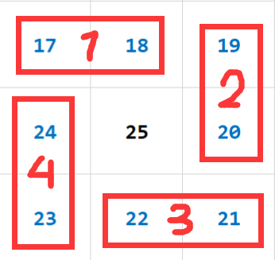

# Math

*summary*

**Math**是数学题，需要套用

---

*2021.07.18*

### 螺旋数组

> [LCP 29. 乐团站位](https://leetcode-cn.com/problems/SNJvJP/)

#### 求`mat[i][j] % k`

- 这种情况下边长可能会给的很大，如`10^9`。

- 先观察一个5x5的螺旋数组（4x4的同理），可以发现它中间包着的就是一个3x3的小螺旋数组，3x3中间也包着一个1x1。称每种颜色的一圈数字为一**大圈**，最内层的大圈为**第1大圈**，比如24在第2大圈。称数字所在大圈内的计序为**大圈rank**，比如24的大圈rank是8，25的大圈rank是1。

  

- 问题拆解为：

  - 大前提：矩阵边长为`N`
  - `mat[i][j]`所在的大圈：`k`。
  - 后几个大圈的数字总个数：`sum`。
  - `mat[i][j]`的大圈rank：`rank`。
  
  - 得出结果`val=sum+rank`

##### `mat[i][j]`所在的大圈

可以从距离中心坐标的距离来判断

- 中心坐标：`((N-1)/2, (N-1)/2)`

- 距离中心坐标的**垂直最大距离**：`max(|i-(N-1)/2|, |j-(N-1)/2|)`

- 此时如果用这个距离表示矩阵就是这样：

  

- 最后得出所在的大圈`k`

$$
c=\frac{N-1}{2}\\
k=1+floor[max(\left | i-c \right |,\left | j-c \right |)]
$$

- 奇数阵：比如24的坐标是(2,1)

$$
c=\frac{5-1}{2}=2\\
k=1+floor[max(\left | 2-2 \right |,\left | 1-2 \right |)]=2
$$

- 偶数阵：比如11的坐标是(2,0)

$$
c=\frac{4-1}{2}=1.5\\
k=1+floor[max(\left | 2-1.5 \right |,\left | 0-1.5 \right |)]=2
$$

##### 后几个大圈的数字总个数

- 要知道这个，我们得先知道第`x`大圈的数字个数

- 第`x`大圈的边长：
  $$
  n(x)=x*2-N\bmod2
  $$

- 第`x`大圈的数字个数
  $$
  s(x)=4*n(x)-4=8*x-4*(N\bmod2)-4
  $$

- 最外层大圈的边长一定等于N，所以可以倒推出有几层：
  $$
  n(x_{max})=N\\
  x_{max}=\frac{N+N\bmod2}{2}
  $$
  
- 后几个大圈的数字总个数：

$$
\begin{align}
sum & =\sum_{i=k+1}^{x_{max}}s(i)=(x_{max}-k)*[s(x_{max})+s(k+1)]/2\\
& = 4*(x_{max}-k)*(x_{max}-k+N\bmod2)
\end{align}
$$

##### `mat[i][j]`的大圈rank

- 观察第k大圈的四个角坐标

$$
up=x_{max}-k\\
down=N-1-up\\
UpperLeft:(up,up)\\
UpperRight:(up,down)\\
LowerRight:(down,down)\\
LowerLeft:(down,up)
$$

- 这样，给定的坐标和这四个角的坐标的大小存在四种排列组合情况，刚好对应了四条边。注意：必须依次判断

  

  - 1：`i==up`
    $$
    rank=j-up+1
    $$

  - 2：`j==down`
    $$
    rank=1*[n(k)-1]+i-up+1
    $$

  - 3：`i==down`

  $$
  rank=2*[n(k)-1]+down-j+1
  $$

  - 4：`j==up`

  $$
  rank=3*[n(k)-1]+down-i+1
  $$

---

*2021.08.26*

### 线段交集

> [836. 矩形重叠 - 力扣（LeetCode） (leetcode-cn.com)](https://leetcode-cn.com/problems/rectangle-overlap/)

- 要判断`(a1,a2)`和`(b1,b2)`两段线段是否有重叠：

  ```cpp
  min(a2,b2)>max(a1,b1);
  ```

  
