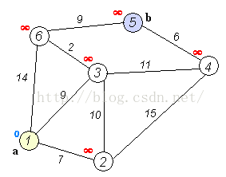

# 图

*summary*

**图**的主要问题有最短路径。

---

*2022.02.25*

### 最短路径 之 Dijsktra

> [1786. 从第一个节点出发到最后一个节点的受限路径数 - 力扣（LeetCode） (leetcode-cn.com)](https://leetcode-cn.com/problems/number-of-restricted-paths-from-first-to-last-node/)
>
> [迪杰斯特拉 & 堆优化_Dmaxiya-CSDN博客_迪杰斯特拉堆优化](https://blog.csdn.net/CSDNjiangshan/article/details/79345031)
>
> [poj 2387 Dijkstra入门（动态图解）_转角的守望-CSDN博客_迪杰斯特拉动图](https://blog.csdn.net/Summer__show_/article/details/52055637)

- 已知一张图和各条边的权重，求起点A到终点N的最短路径



#### 基本算法

- 使用前提：完全图，节点1000个以上，时间复杂度为$O(n^2)$
- 思路：
  - 本质思路是基于贪心，不断地从**还未确定最短路径的节点集合**中找到当前路径最小的节点。由于**边权非负**，所以这个节点的最短路径就相当于确定了，然后去更新一下子节点的最短路径。
- 初始化：
  - `vector<int> dis(N)`：存储A->X的最短路径。**初始**除了`dis[0]=0`以外全部初始化为`INT_MAX`
  - `set<int> visited`：已经确定不会更新的节点。
  - `vector<vector<int>> edges`：邻接矩阵，**稠密图专用**。`edges[i][j]`就能代表i到j的权重
- 遍历：
  - 寻找当前还未在`visited`中而且`dis`最小的节点
  - 放入`visited`
  - 访问这个节点的所有子节点：
    - 将其`dis`更新为`dis`和`dis[该节点]+edges[该节点][子节点]`的**最小值**

#### 堆优化

- 使用前提：稀疏图，时间复杂度为$O(m\log{m})$，其中$m$为边的数量
- 思路：
  - 寻找最短路径的节点时，我们如果已经将从起点A到所有其他节点的最短路径排序好了呢？直接取出最短的那条便是了。因此用到优先队列，将远的点都排在后面处理，优先处理最近的边。
  - 在这个算法下，一个节点可能会入队很多次，遍历操作的上限取决于边的数量
- 初始化：
  - `vector<int> dis(N)`：存储A->X的最短路径。**初始**除了`dis[0]=0`以外全部初始化为`INT_MAX`
  - `priority_queue<pair<int,int>> nearest`：距离起点最近的节点。**初始**放入{0，起点A}
  - `vector<vector<pair<int,int>>> edges` ：邻接表，**稀疏图专用**。遍历`edges[i]`得到所有i为起点的边的信息（终点，权重）
- 遍历：
  - 取出距离起点最近的节点和距离。
  - 对比取出的距离和`dis`中的距离，如果不同说明信息已经滞后了，无需考虑
  - 更新这个节点的子节点的最短路径，并且向队列中放入更新后的节点。

```cpp
vector<int> dis(n+1,INT_MAX);
vector<vector<pair<int,int>>> g(n+1);
for(auto &e:edges){
    int u=e[0],v=e[1],w=e[2];
    g[u].push_back({v,w});
    g[v].push_back({u,w});
}
priority_queue<pair<int,int>> pq;
pq.push({0,n});
dis[n]=0;
while(!pq.empty()){
    auto [smallDis,sourceNode]=pq.top(); pq.pop();
    smallDis=-smallDis;//取出时再取负回正
    if(smallDis!=dis[sourceNode]) continue;//由于下边的更新操作无法更新到队列中的其他元素，于是排除一些滞后的信息
    for(auto [targetNode,weight]:g[sourceNode]){
        if(dis[targetNode]>smallDis+weight){
            dis[targetNode]=smallDis+weight;
            pq.push({-dis[targetNode],targetNode});//为了将优先最大变成优先最小，取负后放进
        }
    }
}
```

---

*2022.02.26*

### 拓扑排序

> [851. 喧闹和富有 - 力扣（LeetCode） (leetcode-cn.com)](https://leetcode-cn.com/problems/loud-and-rich/)

#### 算法：

- 在构造邻接矩阵/邻接表的时候，统计一下各节点的入度
- 将所有入度为0的放入一个队列
- 队列每次取出节点后：
  - 输出节点
  - 把所有子节点的入度减1，如果减到0，将该子节点入队。
- 输出的节点顺序就是拓扑序
