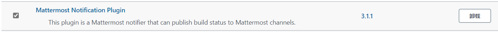
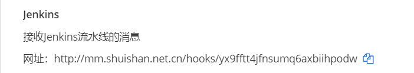
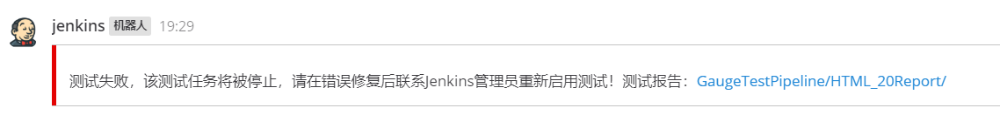
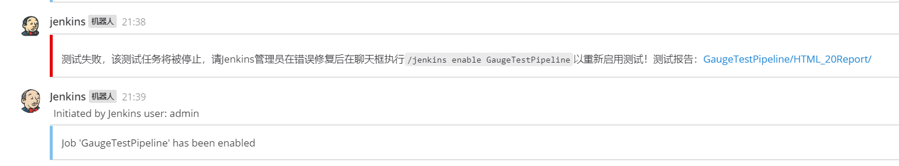
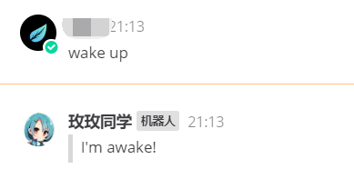
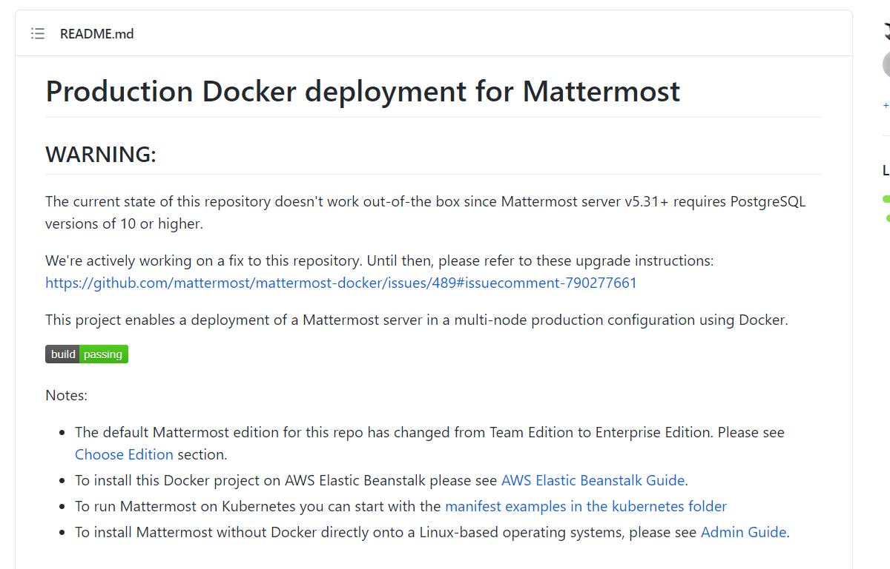
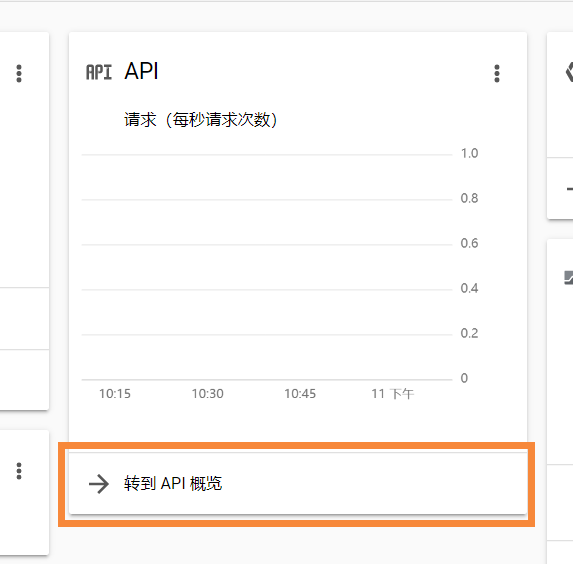
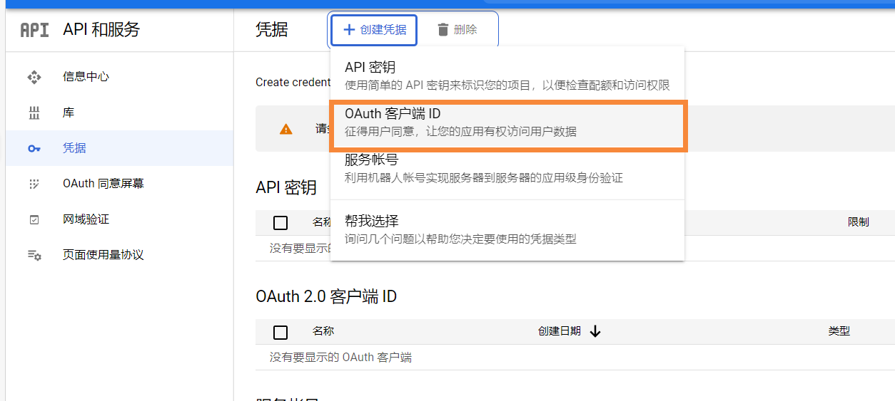
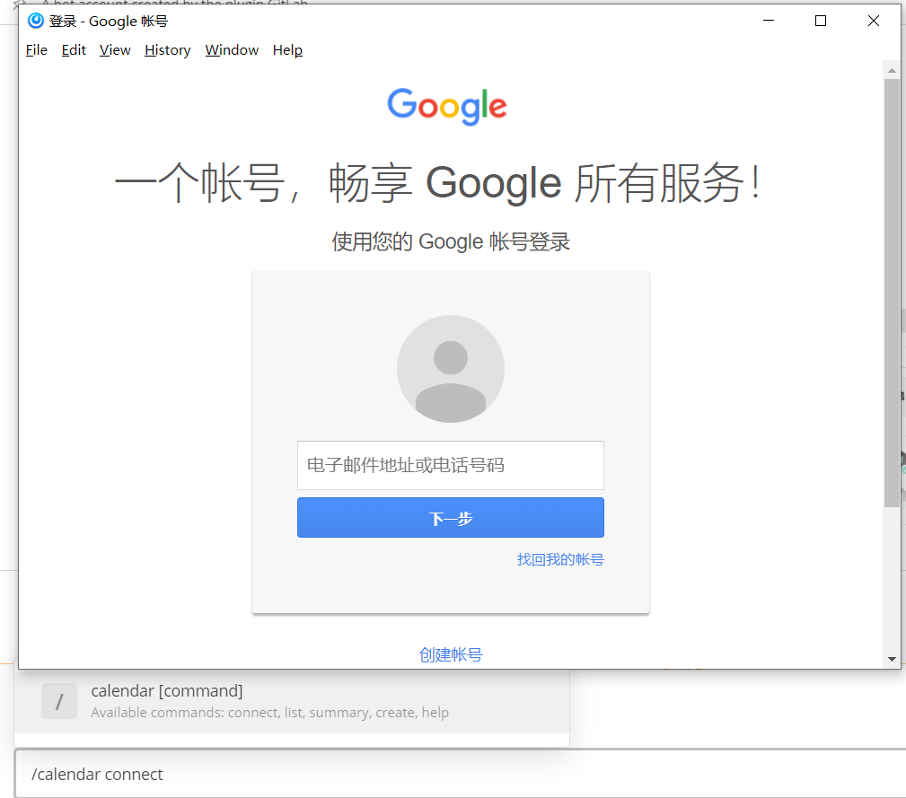
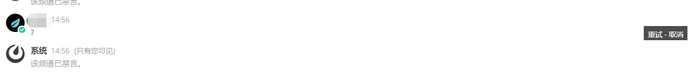

# Mattermost

*summary*


**Mattermost**是一个聊天工具

---

*pinned*

### 安装Docker版

- 非官方的安装教程（不过很管用）：[Deploy Mattermost on Docker](https://docs.mattermost.com/install/prod-docker.html)

#### 改动：不安装web镜像；安装team版本而不是企业版

- 因为我们可以用自己的nginx进行反向代理。

- 在`{mattermost_docker}/docker-compose.yml`中注释web部分，并在app处开放端口及添加edition的声明

  ```yaml
  app:
    args:
      - edition=team
    ports:
      - "14080:8000"
      - "14443:443"
      
  # web:
  #   build: web
  #   ports:
  #     - "80:80"
  #     - "443:443"
  #   read_only: true
  #   restart: unless-stopped
  #   volumes:
  #     # This directory must have cert files if you want to enable SSL
  #     - ./volumes/web/cert:/cert:ro
  #     - /etc/localtime:/etc/localtime:ro
  ```

#### 改动：国内镜像源添加

- 在`{mattermost_docker}/app/Dockerfile`中添加apk仓库源

  ```dockerfile
  # ICY's Changes
  RUN echo -e http://mirrors.ustc.edu.cn/alpine/v3.11/main/ > /etc/apk/repositories
  RUN echo -e http://mirrors.ustc.edu.cn/alpine/v3.11/community/ >> /etc/apk/repositories
  # Install some needed packages
  # ...
  ```

- 在`{mattermost_docker}/db/Dockerfile`中添加apk仓库源，pip镜像源

  ```Dockerfile
  # ICY's Changes
  RUN echo -e http://mirrors.ustc.edu.cn/alpine/v3.11/main/ > /etc/apk/repositories
  RUN echo -e http://mirrors.ustc.edu.cn/alpine/v3.11/community/ >> /etc/apk/repositories
  # ICY's Changes pip
  RUN echo "azure<5.0.0" > pip-constraints.txt
  RUN apk add --no-cache \
        build-base \
        curl \
        libc6-compat \
        libffi-dev \
        linux-headers \
        python-dev \
        py-pip \
        py-cryptography \
        pv \
        libressl-dev \
      && pip install -i https://mirrors.aliyun.com/pypi/simple/ --upgrade pip \
      && pip --no-cache-dir install -i https://mirrors.aliyun.com/pypi/simple/ -c pip-constraints.txt 'wal-e<1.0.0' envdir \
      && rm -rf /var/cache/apk/* /tmp/* /var/tmp/*
  ```

---

*2021.01.05*

### 多层nginx+挂载文件的配置修改之路

> 这个问题并未完全解决，以下草稿仅供参考，很可能有杂乱/缺失/错误等情况

web是nginx

dockerfile copy文件

entrypoint 软连接

还得手动修改/etc/nginx/conf.d然后nginx -s reload

下次停用web，因为外部已经有nginx代理  或者 研究透彻它的原理

---

*2021.04.13*

### Gauge测试UI+Jenkins流水线+Mattermost消息订阅（Mattermost篇）

其他两篇相关文章为

- [Gauge测试UI+Jenkins流水线+Mattermost消息订阅（Gauge篇）](../前端%20FrontEnd/Gauge.md/#gauge测试uijenkins流水线mattermost消息订阅gauge篇)
- [Gauge测试UI+Jenkins流水线+Mattermost消息订阅（Jenkins篇）](../运维%20DevOps/Jenkins.md/#gauge测试uijenkins流水线mattermost消息订阅jenkins篇)

> [持续交付流水线中的消息传递与协作实现](https://blog.csdn.net/weixin_40046357/article/details/106464610)

#### Jenkins安装Mattermost订阅插件

- 在上篇Jenkins Job获取到测试情况后，我们可以根据结果进行不同的处理

  - 如果测试通过，则只是保存测试报告而不告警。30min后重新启动测试
  - 如果测试失败，需要将“测试失败”消息和测试报告URL推送至Mattermost的频道。不会再次启动测试，需要在Mattermost使用斜杠命令重启job

- Jenkins安装Mattermost插件，之后便可在pipeline中发送消息：

  


#### Mattermost添加集成

- 首先创建一个接收消息的频道**jenkins_hook**

- **团队选项 > 集成 > 传入Webhooks** 中添加新的引入勾子：

  - 用户名：jenkins
  - 个人资料照片：`https://cdn.iconscout.com/icon/free/png-256/jenkins-5-569553.png`

- 会获得一个重要的订阅链接，妥善保存，这个将在Jenkins高级篇用到

  

- 最终效果：



#### Mattermost配置Jenkins插件

- 在**团队设置 > 插件集市**找到Jenkins并安装
- 在配置页面填上`your_jenkins_url`，**重新生成**下面的`At Rest Encryption Key`
- 现在可以使用斜杠命令向jenkins发送命令：
  - 使用API_TOKEN（在Jenkins个人页中获取）连接Jenkins server：`/jenkins connect admin API_TOKEN`
  - 启用被禁用的Job：`/jenkins enable your_jobname`

- 最终效果：

  

---

*2021.04.19*

### 安装聊天机器人Mattermost-bot

> 这个问题并未完全解决，以下草稿仅供参考，很可能有杂乱/缺失/错误等情况

> [self.team_id = self.initial['teams'][0]['id'] KeyError: 'teams'](https://github.com/LPgenerator/mattermost_bot/issues/60)
>
> [attzonko/mmpy_bot](https://github.com/attzonko/mmpy_bot)
>
> [Bot Account Creation](https://docs.mattermost.com/developer/bot-accounts.html#user-interface-ui)

- 截止2021.04.19，Mattermost已经使用api/v4，因此这里使用了一位开发者的个人fork版本，可以兼容新版本api
- 最好的体验需要python 3.8+环境
- `pip install mmpy_bot`：安装mmbot

#### 注册

- 确认开启了创建机器人的功能：**系统控制台 > 机器人账户 > 开启机器人帐号创建** 须为**是**
- **主菜单 > 集成 > 机器人账户**，选择**添加机器人帐号**
  - 用户名：`mm_bot`
  - 角色：系统管理员
- 记下生成的**访问令牌**（你将不会看到第二次！）

#### 配置并启动bot

- 编写`run.py`，这里是模板

  ```python
  from mmpy_bot import Bot, Settings, ExamplePlugin, WebHookExample
  
  bot = Bot(
      settings=Settings(
          MATTERMOST_URL = "http://<mattermost_server_url>",
          MATTERMOST_PORT = 80,
          BOT_TOKEN = "<your_bot_token>",
          BOT_TEAM = "<team_name>",
          SSL_VERIFY = True,
      ),
      plugins=[ExamplePlugin(), WebHookExample()],
  )
  bot.run()
  ```
```
  
- 注意URL最后不要带斜杠
  
- `python run.py`运行，如果看到这样的信息，就说明启动成功了

  ```log
  [04/19/2021 17:52:14][mmpy.bot][INFO] Starting bot Bot.
  [2021-04-19 17:52:14,493][mmpy.bot][INFO] Starting bot Bot.
  [04/19/2021 17:52:14][mmpy.threadpool][INFO] Scheduler thread started.
  [2021-04-19 17:52:14,497][mmpy.threadpool][INFO] Scheduler thread started.
  [04/19/2021 17:52:14][mattermostdriver.websocket][INFO] Websocket authentification OK
  [2021-04-19 17:52:14,648][mattermostdriver.websocket][INFO] Websocket authentification OK
```

- 这里使用的是示例插件，只是监听了一些最基础的消息，比如可以去mattermost测试发送信息：`@机器人 hello_channel`

  

#### 编写自定义插件

- 在同级目录下新建一个py文件：`my_plugin.py`。这里是最简单的插件示例：

  ```python
  from mmpy_bot import Plugin, listen_to
  from mmpy_bot import Message
  
  class MyPlugin(Plugin):
  
      @listen_to("wake up")
      async def wake_up(self, message: Message):
          self.driver.reply_to(message, "I'm awake!")
  ```

- 补充`run.py`，将自己的插件导入进来：

  ```python
  from my_plugin import MyPlugin
  
  bot = Bot(
      settings=Settings(
          # ...
      ),
      plugins=[ExamplePlugin(), WebHookExample(),MyPlugin()]
  )
  bot.run()
  ```

- 重新运行后就能看到自己编写的方法回复了：

  


---

*2021.04.22*

### 手动进行5.31.0版本升级至5.32.1

> https://github.com/mattermost/mattermost-docker/issues/489#issuecomment-790277661

- 在2021/04/22这天，我发现mattermost-docker-compose版的仓库贴出了一则警告，大概意思是目前需要手动升级PostgreSQL的版本才能继续更新Mattermost服务器版本。这也是一个临时的手段，开发者们也在修复当中。

  

- 由于这里需要对多个MM紧急升级的需求，又因为手动升级的脚本和步骤过多，所以作个记录。

- `cd {mattermost-docker}/`：进入服务器（宿主机）上`mattermost-docker`的目录

- `touch upgrade.sh`：新建一个升级脚本

- 粘贴下面的脚本：

  ```sh
  #!/bin/bash
  
  # Credit for helping to outline the correct upgrade process goes to @tuxity and @GuidoDr
  
  ##
  ## Instructions
  ##
  
  # 1. Edit the variables below to match your environment. This uses default variables and assumes you're on 5.31.0.
  #    If you're wanting to use another version of Postgres/Mattermost , update the variables as desired.
  
  # 2. Copy the contents of this script into a file within your mattermost-docker folder. This is essential. 
  #    You can use 'sudo touch upgrade.sh && sudo nano upgrade.sh' then paste the script.
  
  # 3. run 'sudo bash upgrade.sh' replace upgrade.sh with what you've named the file.
  #    This may take some time to complete as it's migrating the database to Postgres 13.6 from 9.4
  
  
  ##
  ## Environment Variables
  ##
  
  # Below is default values in the mattermost-docker container. If you've edited these you will need
  # to modify them before running the script or this will generate a new databse.
  POSTGRES_USER="mmuser"
  POSTGRES_PASSWORD="mmuser_password"
  POSTGRES_DB="mattermost"
  
  # You should be on Postgres 9.4. To get your version run
  # 'sudo cat volumes/db/var/lib/postgresql/data/PG_VERSION' to confirm this.
  POSTGRES_OLD_VERSION=9.4
  POSTGRES_NEW_VERSION=13
  
  # This tag is found here - https://hub.docker.com/_/postgres'
  # This tag needs to be an apline release to include python3-dev
  POSTGRES_DOCKER_TAG='13.2-alpine'
  POSTGRES_OLD_DOCKERFILE=`sudo cat ./db/Dockerfile | grep 'FROM postgres'`
  POSTGRES_NEW_DOCKERFILE='FROM postgres:'$POSTGRES_DOCKER_TAG
  
  
  # This is found here - https://github.com/tianon/docker-postgres-upgrade
  # The string here needs to match a folder on that repo. It should read 'old-to-new'.
  UPGRADE_LINE='9.4-to-13'
  
  # Mattermost Versions
  CURRENT_MM_VERSION="5.31.0"
  NEW_MM_VERSION="5.32.1"
  
  ##
  ## Script Start
  ##
  
  docker-compose stop
  
  # Creating a backup folder and backing up the mattermost / database.
  mkdir ./backups
  cp -ra ./volumes/app/mattermost/ backups/mattermost-backup-$(date +'%F-%H-%M')/
  cp -ra ./volumes/db/ backups/database-backup-$(date +'%F-%H-%M')/
  
  mkdir ./volumes/db/$POSTGRES_OLD_VERSION && mv volumes/db/var/lib/postgresql/data/ volumes/db/$POSTGRES_OLD_VERSION
  rm -rf ./volumes/db/var
  mkdir -p ./volumes/db/$POSTGRES_NEW_VERSION/data
  
  
  sed -i "s/$POSTGRES_OLD_DOCKERFILE/$POSTGRES_NEW_DOCKERFILE/" ./db/Dockerfile
  sed -i "s/python-dev/python3-dev/" ./db/Dockerfile
  sed -i "s/$CURRENT_MM_VERSION/$NEW_MM_VERSION/" ./app/Dockerfile
  
  
  # replacing the old postgres path with a new path
  sed -i "s#./volumes/db/var/lib/postgresql/data:/var/lib/postgresql/data#./volumes/db/$POSTGRES_NEW_VERSION/data:/var/lib/postgresql/data#" ./docker-compose.yml
  
  # migrate the database to the new postgres version
  docker run --rm \
      -e PGUSER="$POSTGRES_USER" \
      -e POSTGRES_INITDB_ARGS=" -U $POSTGRES_USER" \
      -e POSTGRES_PASSWORD="$POSTGRES_PASSWORD" \
      -e POSTGRES_DB="$POSTGRES_DB" \
      -v $PWD/volumes/db:/var/lib/postgresql \
      tianon/postgres-upgrade:$UPGRADE_LINE \
      --link
  
  cp -p ./volumes/db/$POSTGRES_OLD_VERSION/data/pg_hba.conf ./volumes/db/$POSTGRES_NEW_VERSION/data/
  
  # rebuild the containers
  docker-compose build
  docker-compose up -d
  
  # reindex the database
  echo "REINDEX SCHEMA CONCURRENTLY public;" | docker exec mattermost-docker_db_1 psql -U $POSTGRES_USER $POSTGRES_DB
  ```

  - **本地化改动的影响**：由于`FROM postgres:13.2-alpine`使用了新版本的alpine作为基础镜像，我们的镜像源地址也要升级为

    ```dockerfile
    # ICY's Changes
    RUN echo -e http://mirrors.ustc.edu.cn/alpine/v3.12/main/ > /etc/apk/repositories
    RUN echo -e http://mirrors.ustc.edu.cn/alpine/v3.12/community/ >> /etc/apk/repositories
    ```

  - **POSTGRES的用户名配置**：`POSTGRES_USER`，`POSTGRES_PASSWORD`，`POSTGRES_DB`这三个值是和旧容器的数据库匹配的。如果不匹配就不会进行迁移，而是直接新建一个新数据库。

  - **检查旧容器POSTGRES版本**：`POSTGRES_OLD_VERSION`的值可以执行这句命令获得`cat volumes/db/var/lib/postgresql/data/PG_VERSION`

  - **Mattermost版本**：`NEW_MM_VERSION`代表想要升级到的Mattermost版本

  - **最后一行检查容器名**：`mattermost-docker_db_1`代表启动后数据库容器的名称

- `bash upgrade.sh`：运行脚本，时间会有点长。

---

*2021.04.25*

### 安装Google Calendar插件

> [mattermost-plugin-google-calendar/README.md at master · waseem18/mattermost-plugin-google-calendar · GitHub](https://github.com/waseem18/mattermost-plugin-google-calendar/blob/master/README.md)
>
> [[MM-11379\] Build a sample Google Calendar plugin for Mattermost - Mattermost (atlassian.net)](https://mattermost.atlassian.net/browse/MM-11379)
>
> [google cloud platform - OAuth consent screen - ability to remove application logo - Stack Overflow](https://stackoverflow.com/questions/56989198/oauth-consent-screen-ability-to-remove-application-logo)
>
> [Go quickstart  | Calendar API  | Google Developers](https://developers.google.com/calendar/quickstart/go)
>
> [设置 HTTPS 代理  | Migrate for Compute Engine（原 Velostrata）  | Google Cloud](https://cloud.google.com/migrate/compute-engine/docs/4.8/how-to/using-cloud-extensions/setting-up-https-proxy)

- 这个插件将使用webhook向mattermost推送Google Calendar的提醒。

#### 直接使用Release版本的配置过程

- 去[谷歌云面板](https://console.cloud.google.com/home/dashboard)创建一个新的项目，例如叫`Mattermost-Google Calendar`

- **API > 转到API概览 > 凭据 > 创建凭据 > OAuth客户端ID**

  

  

- 如果需要先创建OAuth同意屏幕，选择**OAuth同意屏幕 > 外部**

  - **OAuth同意屏幕**

    - 应用名称：`Mattermost`

    - 用户支持电子邮件：`<your_gmail>@gmail.com`

    - **千万不要填写非必填项！会导致之后的公开版需要进行验证！**（当然如果你就是需要的话也可以填）
  - **范围**：无需进行配置
  - **测试用户**：无需进行配置
  - 最后记得发布一下，使得所有用户可以使用。

- 回到创建凭据部分

  - **应用类型**选择**Web应用**，**名称**填写`Mattermost-<your_server_name>`，**已获授权的 JavaScript 来源**填写`https://<your_mattermost_server>`，**已获授权的重定向 URI**填写`https://<your_mattermost_server>/plugins/com.mattermost.google-calendar/oauth/complete`
  - 至此获得了插件配置所需的`Client ID`和`Secret`

- 在左侧栏找到**网域验证**，添加网域`<your_mattermost_server>`
  
  - 如果需要验证所有权，请先按照提示在Google Search Console处验证。
  
- 在左侧栏找到**库**，启用**Google Calendar API**

- 从[这里](https://github.com/mattermost/mattermost-plugin-google-calendar/releases)下载最新的插件版本（*.tar.gz），在Mattermost里通过**系统控制台 > 插件管理 > 上传插件**上传
  
- 上传自定义插件默认关闭，需要去手动配置`PluginSettings > EnableUploads`为`true`
  
- 现在尝试输入斜杠命令`/calendar connect`吧，成功！

  

  - 未审核的公开版会有一系列警告，但可以点击继续。

  - 如果出现`Error setting up Config Exchange`，可能是你的Mattermost服务器（容器）无法访问到谷歌服务器，参考源码中（`/server/plugin.go`）出现了谷歌的域名：

    ```go
    
    func (p *Plugin) getOAuthConfig() *oauth2.Config {
    	pluginConfig := p.getConfiguration()
    	config := p.API.GetConfig()
    
    	return &oauth2.Config{
    		ClientID:     pluginConfig.CalendarOAuthClientID,
    		ClientSecret: pluginConfig.CalendarOAuthClientSecret,
    		RedirectURL:  fmt.Sprintf("%s/plugins/google-calendar/oauth/complete", *config.ServiceSettings.SiteURL),
    		Scopes:       []string{"https://www.googleapis.com/auth/calendar.readonly", "https://www.googleapis.com/auth/calendar.events.readonly"},
    		Endpoint:     google.Endpoint,
    	}
    }
    ```
    
  - 如果你想设置代理网址列表，这里是使用Google API需要访问的域名
  
    ```log
    accounts.google.com
    cloudresourcemanager.googleapis.com
    www.googleapis.com
    iam.googleapis.com
    storage.googleapis.com
    ```


#### 本地源码编译

> [mattermost/mattermost-plugin-google-calendar: Mattermost Google Calendar Plugin (github.com)](https://github.com/mattermost/mattermost-plugin-google-calendar)
>
> [golang http请求时设置代理ip_、Edgar的博客-CSDN博客](https://blog.csdn.net/weixin_44676081/article/details/112058814)
>
> [ubuntu下GOROOT和GOPATH配置_typ2004的专栏-CSDN博客](https://blog.csdn.net/typ2004/article/details/39559873)

- 如果你需要自行编译最新源码然后打包再上传，就需要自己生成插件包

- 需要下载npm、go、golang-lint和Linux自带的make进行编译
  - npm：https://www.npmjs.com/get-npm
  
  - go：https://golang.org/doc/install
  
  - golangci-lint：https://golangci-lint.run/usage/install/。下面是国内镜像版的修改：
  
    - 国内镜像版：`wget https://raw.fastgit.org/golangci/golangci-lint/master/install.sh`
  
    - 检查一下`install.sh`里面所有`github.com`，替换为`hub.fastgit.org`
  
    - `cat install.sh | sh -s -- -b $(go env GOPATH)/bin v1.39.0`
  
    - 如果还是没有出现，请检查系统路径是否配置：
  
      ```sh
      export GOROOT=/usr/lib/go #记得改成自己的
      export GOPATH=$HOME/gocode #记得改成自己的
      
      export PATH=$PATH:$GOPATH/bin
      ```

- `dist/com.mattermost.google-calendar-0.2.0.tar.gz`就生成了

---

*2021.04.29*

### 安装订阅插件

> [wbernest/mattermost-plugin-rssfeed: Mattermost RSSFeed plugin. Allows users to subscribe to an rss feed and allow for updates to the feed to be posted in a channel. (github.com)](https://github.com/wbernest/mattermost-plugin-rssfeed)
>
> [does dev.to have rss feed? - DEV Community](https://dev.to/pachijun/comment/l882)
>
> [Is there a way to aggregate dev.to RSS feeds? - DEV Community](https://dev.to/alexkhismatulin/is-there-a-way-to-aggregate-dev-to-rss-feeds-4lan)
>
> [Hacker News RSS (hnrss.github.io)](https://hnrss.github.io/)

- 首先到上面的Github仓库下载最新版release
- 然后上传插件文件到Mattermost即可

- 启用集成机器人的头像和用户名：
  - **系统控制台 > 集成 > 集成管理**，启用**允许整合覆盖用户名**，**允许整合覆盖头像**
  - 不然会使用`webhook`和**集成的创建者头像**作为默认用户名和头像

- 插件配置里可以设定轮询rss时间（默认15分钟），消息的格式等
- 要使用该插件，需要到你希望推送消息的频道中，然后输入斜杠命令
- `/feed subscribe <url>`：订阅一个新的url
- `/feed unsubscribe <url>`：取消订阅url
- `/feed list`：列出当前已订阅的url

- 这里列出几个示例rss：
  - dev.to：`dev.to/feed/tag/opensource`
  - hacker news 的 show 频道：`https://hnrss.org/show`

### 安装禁言插件

> [Brightscout/mattermost-plugin-disable-dm: A mattermost plugin to disable direct messages and group chats. (github.com)](https://github.com/Brightscout/mattermost-plugin-disable-dm)

- 首先到上面的Github仓库下载最新版release
- 然后上传插件文件到Mattermost即可
- 禁言效果是私信和私聊群的消息会受到阻挡，并显示一条提示消息。（虽然下图能看到自己的消息，但实际上其他人是看不到的）



