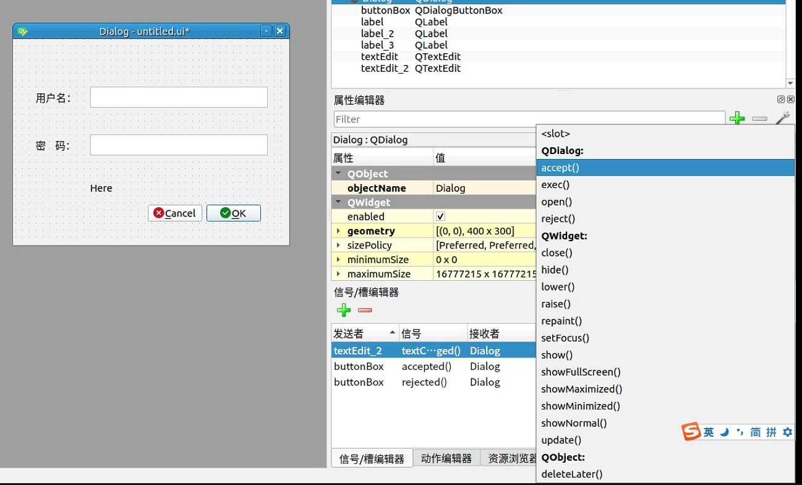
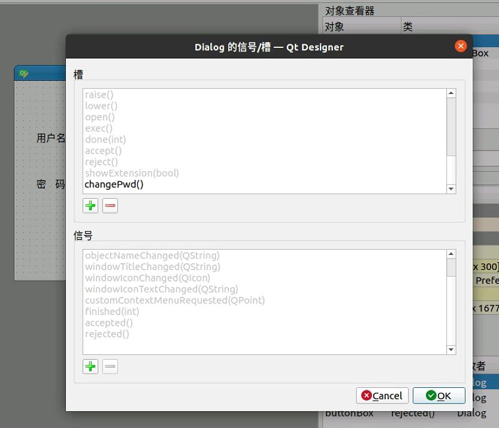

# QT Designer

*summary*

在linux系统上可以用**QT Designer**开发桌面应用程序

---

*pinned*

### Ubuntu配置QT开发环境

> [Python 使用QT5开发界面的一个demo开发过程的总结 - 阿布先生 - 博客园 (cnblogs.com)](https://www.cnblogs.com/bu123/p/9895105.html)
>
> [ubuntu下安装qtDesigner，用来进行python界面设计_lightningqw的专栏-CSDN博客](https://blog.csdn.net/lightningqw/article/details/79113335)
>
> [VSCode配置Python、PyQt5、QtDesigner环境并创建一个ui界面测试_宁尧的博客-CSDN博客](https://blog.csdn.net/weixin_40014984/article/details/104531359)

#### 下载Python QT包

- `pip install pyqt5`

- 测试安装是否成功

  ```python
  from PyQt5 import QtWidgets, QtGui
  import sys
  
  app = QtWidgets.QApplication(sys.argv)
  window = QtWidgets.QWidget();
  window.show()
  sys.exit(app.exec_())
  ```

#### 安装QT Designer

- `sudo apt-get install qt5-default qttools5-dev-tools`
- 终端执行`designer`即可

#### VSCode配置安装环境

- ` sudo apt-get install pyqt5-dev-tools`

- 安装插件`PYQT Integration`(Feng Zhou)

- 打开扩展设置，设置`Pyqt-integration > Qtdesigner: Path`这一项为QT Designer路径，我这里的路径是`/usr/lib/x86_64-linux-gnu/qt5/bin/designer`

- 现在在资源管理器空白处右键，就会出现`PYQT: New Form`

- 对QT Designer生成的`.ui`文件右键，就会出现`PYQT: Compile Form`

- 这样会生成`.py`格式的窗体类，再准备一个**类似这样的**程序入口文件`main.py`

  ```python
  import sys
  from PyQt5.QtWidgets import QApplication, QMainWindow
  
  import Ui_untitled
  
  if __name__ == '__main__':
      app = QApplication(sys.argv)
      MainWindow = QMainWindow()
      ui = Ui_untitled.Ui_MainWindow()
      ui.setupUi(MainWindow)
      MainWindow.show()
      sys.exit(app.exec_())
  ```

---

*2021.07.07*

### 为控件添加点击事件、改变事件等

> [QT 为按钮添加事件_a1054359972的博客-CSDN博客_qt按钮点击事件](https://blog.csdn.net/a1054359972/article/details/50748642)
>
> [PyCharm+QTDesigner+PyUIC使用教程 - 诸子流 - 博客园 (cnblogs.com)](https://www.cnblogs.com/lsdb/p/9122425.html)

- 新建一个Dialog

- 在QT Designer中，可以通过信号/槽编辑器来设定事件，比如现在要让密码文本框`textEdit_2`每次内容改变的时候，将值显示在`Here`

  

- 新建一条记录

  - 发送者：`textEdit_2`

  - 信号：`textChanged()`，这是输入框自带的一个事件
  - 接收者：`Dialog`

  - 槽：这时候我们还需要一个槽

- 给`Dialog`新建一个槽，在窗体空白处**右键 > 改变信号 / 槽...**

  - 新建一个槽`changePwd()`

  

- 编译UI为python代码后，新建一个`main.py`文件去实现方法的逻辑

  ```python
  import sys
  from PyQt5.QtWidgets import QApplication, QDialog
  
  from Ui_untitled import Ui_Dialog
  
  class MyPyQT_Dialog(QDialog,Ui_Dialog):
      def __init__(self):
          super(MyPyQT_Dialog,self).__init__()
          self.setupUi(self)
  
      def changePwd(self):
          self.label_3.setText(self.textEdit_2.toPlainText())
  
  if __name__ == '__main__':
      app = QApplication(sys.argv)
      my_pyqt_form = MyPyQT_Dialog()
      my_pyqt_form.show()
      sys.exit(app.exec_())
  ```
  
  

