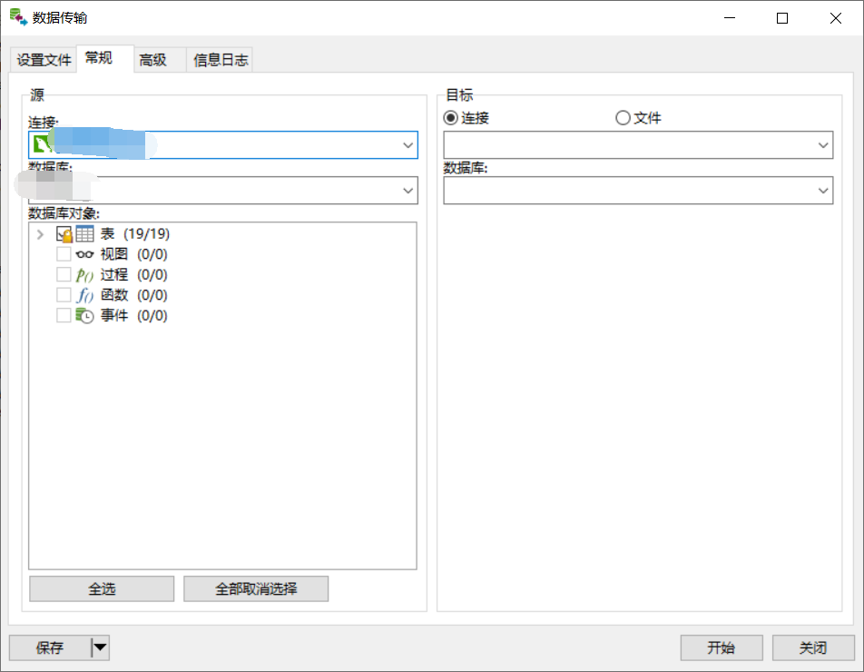

# MySQL

*summary*


**MySQL**是一个轻量级数据库。

---

*2021.05.19*

### 使用Navicat将子数据库数据传输到主数据库中

> [Navicat定时在MySQL与MySQL数据库之间自动传输数据 - 阿叮339 - 博客园 (cnblogs.com)](https://www.cnblogs.com/DFX339/p/11646812.html)
>
> [存储过程：数据的插入和更新 - daixinet.com - 博客园 (cnblogs.com)](https://www.cnblogs.com/sshoub/archive/2011/08/10/2133997.html)
>
> [Mysql 存在既更新，不存在就添加（sql语句）_学医救不了中国人-CSDN博客_mysql 存在更新不存在写入](https://blog.csdn.net/wysnxzm/article/details/80914574)
>
> [mysql：insert ignore、insert和replace区别_彭世瑜的博客-CSDN博客](https://blog.csdn.net/mouday/article/details/81281946)
>
> [如何使用Windows命令行环境查找和替换文件中的文本？ - 问答 - 云+社区 - 腾讯云 (tencent.com)](https://cloud.tencent.com/developer/ask/27227)
>
> [How can you find and replace text in a file using the Windows command-line environment? - Stack Overflow](https://stackoverflow.com/questions/60034/how-can-you-find-and-replace-text-in-a-file-using-the-windows-command-line-envir)
>
> [Out-File (Microsoft.PowerShell.Utility) - PowerShell | Microsoft Docs](https://docs.microsoft.com/zh-cn/powershell/module/microsoft.powershell.utility/out-file?view=powershell-7.1#parameters)

首先说明我的需求，已知主从数据库拥有完全相同的表结构，现在多个从数据库中的数据需要汇总到主数据库中。

使用Navicat可以方便的传输数据库表数据

#### 执行一次成功的传输

- **Navicat：工具 > 数据传输**：

  

  - 在左侧选择需要从哪里取出数据，可以选择一个数据库中的部份表。
  - 在右侧选择需要将数据传输到哪里。选择**连接**会**替换**目标数据库的表，选择**文件**可以将数据导出到SQL文件中
  - 点击**开始**则启动传输。

- 这里我不能选择**连接**，因为这样会直接DROP掉主数据库的表。因此选择了**文件**，同时**编码**选择了`65001（UTF-8）`，可以看到每个表都有这样的SQL语句：

  ```sql
  
  -- ----------------------------
  -- Table structure for order_info
  -- ----------------------------
  DROP TABLE `order_info`;
  CREATE TABLE `order_info` (
  `order_id`  char(25) CHARACTER SET utf8mb4 COLLATE utf8mb4_general_ci NOT NULL ,
  `user_id`  char(25) CHARACTER SET utf8mb4 COLLATE utf8mb4_general_ci NOT NULL ,
  `content`  varchar(255) CHARACTER SET utf8mb4 COLLATE utf8mb4_general_ci NULL DEFAULT NULL ,
  PRIMARY KEY (`order_id`)
  )
  ENGINE=InnoDB
  DEFAULT CHARACTER SET=utf8mb4 COLLATE=utf8mb4_general_ci
  
  ;
  
  -- ----------------------------
  -- Records of order_info
  -- ----------------------------
  BEGIN;
  INSERT INTO `order_info` VALUES ('1394940529619300354', '101', null), ('2', '101', '');
  COMMIT;
  ```

  - 直接在主数据库执行这些SQL语句会有以下问题
  - 问题1：就如上述所说的那样，会`DROP`主数据库的表
  - 问题2：`INSERT`时遇到重复记录会报错，造成插入失败
  - 问题3：相同键的记录应该进行更新，这里只有插入操作

- 针对问题1：我们不需要同步表结构的操作，因此在数据传输设置时取消勾选**创建表**和**创建前删除目标对象**

  

- 针对问题2和3：使用`REPLACE INTO`替代`INSERT INTO`可以完美解决。
- 最后传输的语句示例：


#### 定时执行传输任务

以下使用了一个从数据库和一个主数据库进行实验，如果有多个从数据库，那么就重复以下步骤多次。

- 首先在主数据库中建立一个空查询，叫`sql定时汇总`，然后打开它的位置并查看文件路径：`C:\Users\xxx\Documents\Navicat\MySQL\servers\{CONNECTION}\{SCHEMA}\sql定时汇总.sql`

  

- 然后修改数据传输目标的**文件**路径为上述路径，这样每次执行传输任务时，会覆盖这个主数据库的查询文件，起到更新文件的效果。保存数据传输设置文件，为`sql_test`

  

- **计划 > 新建批处理作业**

  - **导出数据**：可用任务中选择Navicat下的`sql_test`，然后**设置计划任务**，默认是每天九点执行一次，但注意要在**计划 > 计划任务 > 高级**设置失效时间，起到时间段里每天执行的效果。

    

  - **导入数据**：可用任务中选择主数据库下的`sql定时汇总`，然后**设置计划任务**，注意要比**导出数据**的计划时间晚10分钟（保证导出的sql文件生成）

- 系统上也启动一个定时任务，为的是将sql中的`INSERT INTO`替换为`REPLACE INTO`，时间大概比**导出数据**的计划时间晚8分钟，这里使用了**Powershell 7.1**（[PowerShell/PowerShell: PowerShell for every system! (github.com)](https://github.com/PowerShell/PowerShell)）

    ```powershell
    (gc 'C:\Users\xxx\Documents\Navicat\MySQL\servers\{CONNECTION}\{SCHEMA}\sql定时汇总.sql') -replace 'INSERT INTO', 'REPLACE INTO' | Out-File -encoding utf8NoBOM 'C:\Users\xxx\Documents\Navicat\MySQL\servers\{CONNECTION}\{SCHEMA}\sql定时汇总.sql'
    ```

- 之后Windows定时任务需要用到批处理文件，因此`bat`文件的写法是

    ```bash
    "C:\Program Files\PowerShell\7\pwsh.exe" -Command "(gc 'C:\Users\leave\Documents\Navicat\MySQL\servers\{CONNECTION}\{SCHEMA}\sql定时汇总.sql') -replace 'INSERT INTO', 'REPLACE INTO' | Set-Content -encoding utf8NoBOM 'C:\Users\leave\Documents\Navicat\MySQL\servers\{CONNECTION}\{SCHEMA}\sql定时汇总.sql'"
    ```

    
