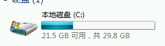

# 虚拟机

*summary*

**虚拟机**的相关安装过程

---

*2021.02.17*

### Windows7虚拟机 镜像iso+激活方法

- [纯净原版镜像下载地址](msdn.itellyou.cn)，ed2k的下载链接可能需要*迅雷*
- 使用Hyper-V安装
  - 只能使用**第一代**，Win7是这样的。
  - 启动内存默认1024MB即可
  - 网络连接选择适合的网卡
- 打开镜像后
  - 安装方式选择**自定义**
  - 安装完毕后弹出`*.iso`驱动器
- 安装完毕后，可以看到系统的大小大概为8.3G。

- [激活工具](https://pan.baidu.com/s/1hLydCaGbjD-mIs6G1dpwUg) 1234

