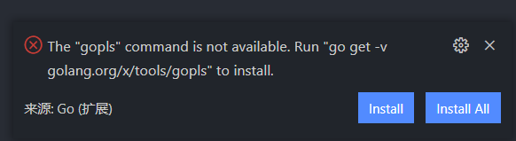

# Go

*summary*


**Go**是一个开源的编程语言

---

*pinned*

### Linux安装Go编译环境

- 下载Go编译器，[Download and install - The Go Programming Language (golang.org)](https://golang.org/doc/install)
- 中国代理：[go切换proxy中国代理 - Awakenedy - 博客园 (cnblogs.com)](https://www.cnblogs.com/awakenedy/articles/12813936.html)

### Linux上VS Code配置Go语言插件

> [Go项目的目录结构 - 迪克猪 - 博客园 (cnblogs.com)](https://www.cnblogs.com/zsy/p/5262632.html)
>
> [vscode安装go所有插件（全网最全）_夏的博客-CSDN博客](https://blog.csdn.net/xiazhipeng1000/article/details/109584712)
>
> [vs code golang开发 代理设置, 告别手动下载工具包_万象博客-CSDN博客](https://blog.csdn.net/jpy1391/article/details/107165366/)
>
> [gometalinter-golang代码质量检查分析工具 - SegmentFault 思否](https://segmentfault.com/a/1190000013553309?utm_source=tag-newest)
>
> [gometalinter cannot be installed with go 1.11 module support enabled · Issue #521 · alecthomas/gometalinter (github.com)](https://github.com/alecthomas/gometalinter/issues/521)
>
> [(3条消息) Installing github.com/uudashr/gopkgs/v2/cmd/gopkgs FAILED VS code中安装Go的插件失败_fu_gui_mu_dan的博客-CSDN博客](https://blog.csdn.net/weixin_40222848/article/details/108686932)

- 如果在VS Code安装完Go扩展，会提示下载一些组件包，此时就会受到不可描述的阻碍



- 如果在Go1.13 及以上，修改代理是最方便的方法
- 只需先在终端执行`export GO111MODULE=on`和`export GOPROXY=https://goproxy.cn`，然后**重新打开窗口**再**Install All**即可
  - 2022.02.08更新：更好用的方式是`go env -w GO111MODULE=on`和`go env -w GOPROXY=https://goproxy.io,direct`
- 另外还需要安装的是`GO111MODULE=off go get -u -v github.com/alecthomas/gometalinter`及`GO111MODULE=off gometalinter --install --force`，这个工具能扫描项目，使得vendor文件夹也有作用
  - `gometalinter ./...`

### Go语言教程

> [k8stech/go-learning: golang 实战课程示例代码 (github.com)](https://github.com/k8stech/go-learning)
>
> [Setting Up Go Locally | Codecademy](https://www.codecademy.com/article/setting-up-go-locally)
>
> [深入学习Golang—channel - 码农教程 (manongjc.com)](http://www.manongjc.com/detail/50-lybwsdrxastdqdj.html)

---

*2021.04.27*

### 为net/http设置代理

> [Setting up proxy for HTTP client - Stack Overflow](https://stackoverflow.com/questions/14661511/setting-up-proxy-for-http-client)
>
> [Error when fetching URL through proxy in Go - Stack Overflow](https://stackoverflow.com/questions/14669958/error-when-fetching-url-through-proxy-in-go)
>
> [使用Privoxy将socks5代理转为http代理_看写写-CSDN博客](https://blog.csdn.net/li740207611/article/details/52045471)
>
> [The Go Playground (golang.org)](https://play.golang.org/p/l0iLtkD1DV)
>
> [linux使用privoxy进行PAC代理 - 起风了 (dyxmq.cn)](https://www.dyxmq.cn/linux/pac-with-privoxy.html)
>
> [Ubuntu 18.04 配置privoxy代理_wangwang的博客-CSDN博客](https://blog.csdn.net/weixin_37532614/article/details/104761903)
>
> [[工具使用\] privoxy 实现 PAC 请求过滤-上地信息-shangdixinxi.com](http://shangdixinxi.com/detail-1349157.html)

- net/http会使用`HTTP_PROXY`和`HTTPS_PROXY`这两个环境变量作为默认的代理方式，因此导入环境变量可以使该系统上的所有net/http都使用该代理地址进行网络请求，是一个全局的方式。支持socks5的协议

  ```shell
  export HTTP_PROXY=http://123.456.789.00:1080
  export HTTPS_PROXY=socks5://123.456.789.00:1081
  ```

- 如果你希望对局部域名使用代理，你可以在代理服务器上创建PAC规则，这里使用privoxy的方式。

  - 假如机器上已经开启了socks5代理：`socks5://127.0.0.1:1080`

  - 首先安装privoxy

    ```shell
    apt-get -y install privoxy
    ```

  - 之后添加PAC自定义规则，添加文件`/etc/privoxy/pac.action`。这里default就说明不使用代理，pac就是使用了代理，当然如果你希望默认走代理而特殊域名不走代理，可以置换一下。

    ```shell
    {{alias}}
    default    = +forward-override{forward .} 
    pac     = +forward-override{forward-socks5 127.0.0.1:1080 .}
     
    {default}
    /
     
    {pac}
    .google.com
    ```
    
    - privoxy的配置文件在`/etc/privoxy/config`。搜索`listen-address`可以看到`listen-address  127.0.0.1:8118`，说明我们的代理地址已经监听在`http://127.0.0.1:8118`了。修改为`listen-address 0.0.0.0:8118`表示开放在局域网，不然其他机器访问会出现`connection refused`情况。`debug`代表日志等级，`cat /var/log/privoxy/logfile`查看日志。`actionsfile`代表应用的pac规则文件，需要注释其他默认规则。
    
    ```python
    #forward-socks5t / 127.0.0.1:1080 .
    
    debug 1
    debug 2
    debug 4
    
    #actionsfile match-all.action # Actions that are applied to all sites and maybe overruled later on.
    #actionsfile default.action   # Main actions file
    #actionsfile user.action      # User customizations
    actionsfile pac.action
    
    #filterfile default.filter
    #filterfile user.filter      # User customizations
    
    listen-address  0.0.0.0:8118
    listen-address  [::1]:8118
    ```
    
  - 最后重启代理服务，并设置开机启动

    ```shell
    service privoxy enable
    service privoxy restart
    ```

---

*2021.06.09*

### 报错module declares its path as A but was required as B

> [go mod module declares its path as: gtihub.com/xxx-xx but was required as:xx-xx_liuqun of program life-CSDN博客](https://blog.csdn.net/liuqun0319/article/details/104054313)	

- 报错格式是

```
...: ...@v1.2.3: parsing go.mod:
        module declares its path as: A
                but was required B
```

- 在当前go.mod中加入一行

```go
replace A => B v1.2.3 // indirect
```

---

*2022.02.08*

### go mod tidy

> [go 1.16.4： go mod tidy的用途_刘宏缔的go森林-CSDN博客_go mod tidy](https://blog.csdn.net/weixin_43881017/article/details/117359986)

- 扫描依赖

---

*2022.07.10*

### golang的代码片段

#### 基础

##### 库

- 可以取别名

```go
import (
	f "fmt"
    t "time"
)
```

##### 变量

- 快速新建变量和初始化

```go
i:=0
str:="hello"
```

- 声明

```go
var a int = 2
```

##### 函数

- 顺序是函数名、参数、返回类型

```go
func countPoints(rings string) (int, float) {
    
}
```

- 函数也是一种类型。
  - 如果要使用自身（递归），得先声明自己的类型。不可以用`:=`的方法

```go
var dfs func(*TreeNode)
dfs = func(n *TreeNode) {
	if n == nil {
		return
	}
  //do something
	dfs(n.Left)
	dfs(n.Right)
}
dfs(root)
```


##### 条件分支

- 可以用分号分隔，先预执行一些代码，然后把判断表达式写在最后一段。
- else需要写在if最后一行括号的同行

```go
if temp:=2; temp < 3{
    
} else if temp>5 {
  
}
```

##### 循环

- C风格

```go
for i:=0;i<5;i++ {
    
}
```

- Python风格
  - range是先拷贝范围，然后再进行循环

```go
for i,c:=range "hello" {
    //只想要元素的话可以用废弃占位符"_"
}
```

##### 字符串

- 字符串遍历
  - 字节遍历：直接用`len(str)`获取长度，然后使用`str[i]`来获取字符
    - string默认是字节存储，因此出现非UTF-8字符时会出现差错
  - range遍历：直接使用`for i, v:= range str {}`
    - 这样`i`仍按字节位置计算
  - 转换后遍历：先转换成`[]rune(str)`，然后就可以用`str[i]`

##### Map、Set

- Golang没有set，直接用map实现

```go
// set
myset := make(map[string]bool)
set["Foo"] = true
delete(set, "Foo")
exists := set["Foo"]
```

###### 无内存空间的替代方案

- 使用`struct{}`并不会使用任何内存空间

```go
type void struct{}
var empty void

set := make(map[string]void)
set["Foo"] = empty
delete(set, "Foo")
_, exists := set["Foo"]
```


##### 数组

- 初始化

  ```go
  //Golang中的数组是值类型，并非是基本数据类型
  var array [10]int
  var array2 = [3]int{1, 2, 3}
  var array3 = [...]int{2, 3, 4}        //让编译器推断数组的长度
  var array4 = [4]int{0: 1, 1: 3, 2: 4} //指定下标进行赋值
  ```

##### 切片

- 初始化

  ```go
  //空
  s := make([]string, 3)
  //引用 区间[a,b)
  tmp := []string{"a","b","c"}
  scopy := tmp[1:2]
  ```

- 删除元素并且不改变原有数组。删除的原理是把待删除元素的右边append到左边的部分后面

  - [go - How to delete an element from a Slice in Golang - Stack Overflow](https://stackoverflow.com/questions/37334119/how-to-delete-an-element-from-a-slice-in-golang)

  - ```go
    func RemoveIndex(s []int, index int) []int {
        ret := make([]int, 0)
        ret = append(ret, s[:index]...)
        return append(ret, s[index+1:]...)
    }
    ```

##### 类型转换

- int->string： 
  - `fmt.Sprintf("%d", 100/3)`
  - `str := strconv.Itoa(int)`
  - int64->：`str := strconv.FormatInt(int64,10)`
- string->int：
  - `i, err := strconv.Atoi(string)`
  - ->int64：`i, err := strconv.ParseInt(string, 10, 64)`

#### 简单

##### math

- 绝对值：`math.Abs(x float64)`

- 最小值：`math.Min(x,y float64) float64`

  - 但，要比较整数该怎么办呢。这里是个可以接受多个整数的写法

    ```go
    func MinOf(vars ...int) int {
        min := vars[0]
    
        for _, i := range vars {
            if min > i {
                min = i
            }
        }
    
        return min
    }
    ```

    


#### 中等

#### 困难
