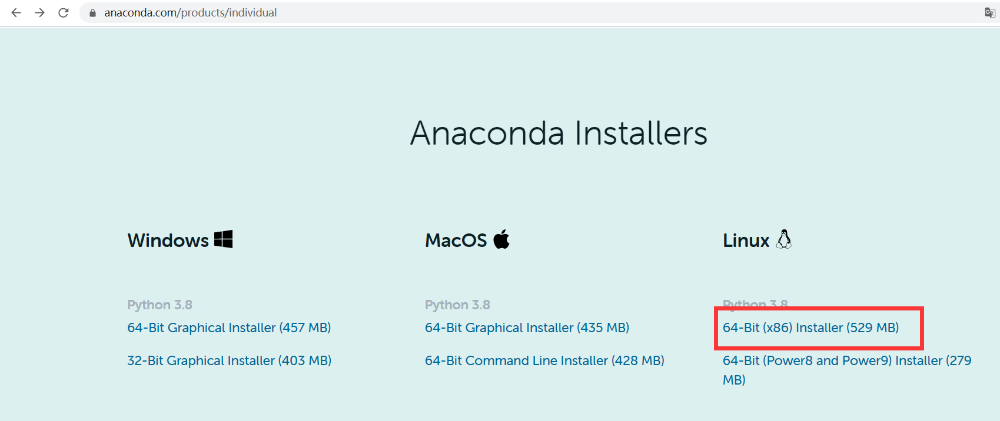
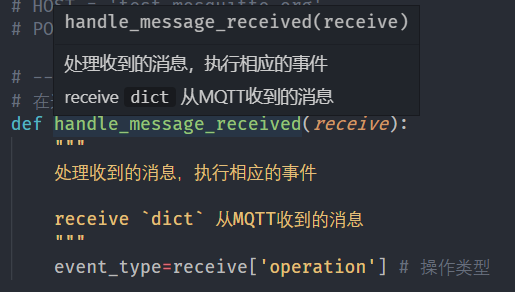

# Python

*summary*


**Python**是一门语言。

---

*pinned*

### Linux-Centos7系统安装教程

> [miniconda安装及环境创建（Linux）](https://blog.csdn.net/weixin_44159487/article/details/105620256)

- 推荐通过安装Anaconda的方式安装Python3

  - > [宝塔面板设置python3默认环境](https://blog.csdn.net/ztb8541/article/details/84025689)

  - 到Anaconda官网复制最新版本的Linux下载链接：[Anaconda Installers](https://www.anaconda.com/products/individual)

    

  - 终端使用命令`wget https://repo.anaconda.com/archive/Anaconda3-2020.11-Linux-x86_64.sh`下载安装脚本

  - `bash Anaconda3-2020.11-Linux-x86_64.sh`开始安装

  - 途中第一次`yes`确认安装地址，第二次`yes`是让下载器执行conda init文件。一些重要的输出：

    ```log
    ==> For changes to take effect, close and re-open your current shell. <==
    
    If you'd prefer that conda's base environment not be activated on startup, 
       set the auto_activate_base parameter to false: 
    
    conda config --set auto_activate_base false
    ```
    
  - 重启ssh终端后，就能看到`(base)`，`conda list`中python的版本就是3.x.x，直接输入`python`也能看到版本为3.x.x
  
  - 创建新的python环境并切换：
  
    ```shell
    conda create -n py37 python=3.7
    conda activate py37
    ```
  
  - 下载新的conda包，并查看安装位置：
  
    ```sh
    conda install xxx
    conda info
    ```

- 或者安装miniconda

  - `mkdir miniconda`：新建一个miniconda文件夹

  - `cd miniconda`

  - `wget https://mirrors.tuna.tsinghua.edu.cn/anaconda/miniconda/Miniconda3-latest-Linux-x86_64.sh`：下载软件

  - `bash Miniconda3-latest-Linux-x86_64.sh`：用bash执行安装脚本

  - 然后按回车键阅读协议，最后回答`yes`。安装好之后还需要一次`yes`，来执行初始化程序

  - 重启终端

  - 输入以下命令

    ```sh
    conda config --add channels https://mirrors.tuna.tsinghua.edu.cn/anaconda/pkgs/free/
    conda config --add channels https://mirrors.tuna.tsinghua.edu.cn/anaconda/pkgs/main/
    conda config --set show_channel_urls yes 
    conda config --set auto_activate_base false
    ```

  - 之后使用方法与Anaconda相同

---

*2020.12.25*

### python-对每个元素依次执行同一个操作，并生成新列表

- map函数可以作映射元素的操作

``` python
>> map(lambda x: x ** 2, [1,2,3])
[1,4,9]
```

> *“这么写不pythonic”*

```python
>> [x**2 for x in [1,2,3]]
[1,4,9]
>> {x:x**2 for x in [1,2,3]}
{1:1,2:4,3:9}
```

### numpy-删除shape=1的维度

``` python
import numpy as np
arr.shape # (3,2,1)
np.squeeze(arr) # (3,2)
```

---

*2020.12.30*

### 借助注释对函数进行说明

- 在函数体内开头的多行注释可以作为函数的介绍
- 用空行代表换行；用`作行内代码块



### 用dict实现switch-case

> [Python switch(多分支选择)的实现](https://www.cnblogs.com/dbf-/p/10601216.html)

- python中没有switch-case的写法，但是可以将函数存储在字典中，然后利用字典来跳转对应的函数。

  ```python
  def case1():
      print('This is the case1')
  
  def case2():
      print('This is the case2')
  
  def default():
      print('No such case')
  
  switch = {
      'case1':case1,
      'case2':case2
  }
  choice = 'case1'
  switch.get(choice,default)()
  ```

### 在Linux服务器上持续运行某个python程序

> [【python】服务器持续在后台运行脚本](https://blog.csdn.net/aximi/article/details/105740502)
>
> [python后台持续运行方法](https://blog.csdn.net/mzm018/article/details/97234712)

- 首先保证程序中利用`while True`来维持运行

- 然后`nohup python -u main.py &`后台运行python脚本。Python参数-u是不启用缓冲，立即将print的内容输出

  - > [用nohup执行python程序时，print无法输出](https://blog.csdn.net/sunlylorn/article/details/19127107)

- 使用`jobs -l`查看运行状态，如果是Running代表正常

- **现在使用exit()断开ssh连接**，直接关闭终端会导致任务中断

- 下次登录时`jobs`看不到之前的进程（由于换了一个终端），所以使用`ps -aux | grep main.py `查找进程

- 想要关闭后台进程时：`kill -9 进程号`

---

*2021.02.01*

### POST json 请求

> [python post json 的一个例子](https://blog.csdn.net/wuzhong8809/article/details/91491146)

```python
adata = {
    "email":"hi"
}
aheaders = {'Content-Type': 'application/json'}

response = requests.post(url, headers=aheaders, data=json.dumps(adata))
```

