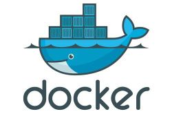

# Docker

*summary*



**Docker**是一个容器管理工具。

---

*pinned*

### 下载Docker-CE

> [Install Docker Engine on CentOS](https://docs.docker.com/engine/install/centos/)

### 下载Docker-Compose

> [官方文档](https://docs.docker.com/compose/install/)

- Linux的下载方式：
  - 下载文件：`sudo curl -L "https://github.com/docker/compose/releases/download/1.27.4/docker-compose-$(uname -s)-$(uname -m)" -o /usr/local/bin/docker-compose`
  - 赋予权限：`sudo chmod +x /usr/local/bin/docker-compose`
  - 建立软连接：`sudo ln -s /usr/local/bin/docker-compose /usr/bin/docker-compose `
  - 开启Docker服务：`service start docker`
  - 设置开机自启动：`systemctl enable docker`

### 卸载Docker-Compose

> [docker-compose的安装和卸载](https://www.cnblogs.com/codehui/p/docker-compose-install.html)

- 直接删除二进制文件：`sudo rm /usr/local/bin/docker-compose`

---

*2020.12.24*

### Docker Compose挂载目录的限制和解决办法

在使用docker-compose.yml挂载目录时...

```yaml
version: '3.6'

services:
  web:
    volumes:
      - ./data:/usr/data                        
```

宿主机文件目录会挂载到容器内文件目录，文件也是双向同步的。但有几条很重要的规则是：

- 启动镜像阶段会执行一次文件挂载
- 如果宿主机不存在该目录，会新建**空的**文件夹
- 然后将宿主机目录的内容**覆盖**容器内的内容

这会导致第一次运行时容器内对应的挂载目录全部清空。

**解决办法**是第一次先采用`docker run -dit`的方式运行镜像，然后执行`docker cp`命令手动将容器内的文件拷贝到宿主机上。之后就可以正常使用了。

---

*2021.01.01*

### Docker常用命令

- `docker logs {container_id} --tail 100 -f -t`
  - `--tail 100`：显示末尾100行
  - `-f`,`--follow`：跟踪实时日志
  - `-t`,`--timestamp`：显示时间戳
- `docker rmi $(docker images -q -f dangling=true)`
  - 删除所有`<none>`镜像
- `docker system prune -a`
  - 删除所有无用的容器、镜像、网络
- `docker stats`
  - 查看相关信息，比较有用的是查看占用的内存
- `docker system df`
  - 查看占用的磁盘空间

---

*2021.01.04*

### ERROR: failed to register layer: Error processing tar file(signal: killed): 

---

*2021.03.04*

### 制作一个可以运行spring-cloud的镜像

> [A Dockerfile for Maven-based Github projects](https://blog.frankel.ch/dockerfile-maven-based-github-projects/)
>
> [翻译：A Dockerfile for Maven-based Github projects](https://blog.csdn.net/dlz00001/article/details/106640610)

- 环境配置阶段1：整个后端由一个**公共模块**和若干个**子模块**组成。众所周知java项目有许多的依赖包，这些可以通过maven进行管理，因此在编译之前，首先要在纯净的容器中借助maven下载公共模块的依赖包。

  ```dockerfile
  # 未优化版本
  FROM maven:3-openjdk-8 as basement
  ARG MY_HOME=/app
  COPY . $MY_HOME
  WORKDIR $MY_HOME
  RUN mvn clean install
  ```
  
	> [Maven Docker镜像使用技巧](https://www.cnblogs.com/ilinuxer/p/6649029.html)

	- **优化1：使用带国内镜像源加速功能的基础镜像**。

  ```dockerfile
  FROM registry.cn-hangzhou.aliyuncs.com/acs/maven as basement
  ```

	- **优化2：利用镜像分层构建的特点，单独将pom.xml作为一层，起到缓存依赖的作用**。
	```Dockerfile
	COPY pom.xml $MY_HOME
	RUN ["/usr/local/bin/mvn-entrypoint.sh","mvn","verify","clean","--fail-never"]
	
	COPY . $MY_HOME
	
	RUN ["/usr/local/bin/mvn-entrypoint.sh","mvn","verify"]
	```
	
	- 最终效果：通过该DockerFile可以构建一个公共模块的镜像
	```dockerfile
	FROM registry.cn-hangzhou.aliyuncs.com/acs/maven as basement
	ARG MY_HOME=/app
	WORKDIR $MY_HOME
	COPY pom.xml $MY_HOME
	RUN ["/usr/local/bin/mvn-entrypoint.sh","mvn","verify","clean","--fail-never"]
	
	COPY . $MY_HOME
	
	RUN ["/usr/local/bin/mvn-entrypoint.sh","mvn","verify"]
	```
	
- 环境配置阶段2：现在子模块可以借助公共模块的镜像继续编译子模块的代码

  - `ARG`需要由外部传入

  - `-P`代表使用对应的生产环境配置文件（需要自己准备）
  
      ```dockerfile
      ARG IMAG_BASE_PROD
      FROM ${IMAGE_BASE_PROD} as builder
      ARG MODULE_NAME
      COPY . /usr/src/app/bx-core-server/${MODULE_NAME}
      WORKDIR /usr/src/app
      RUN cd /usr/src/app/bx-core-server/${MODULE_NAME} \
        && mvn clean install -P docker
      ```
  
- 打包阶段：

  - 使用`openjdk`运行项目

      ```dockerfile
      FROM openjdk:8u265-jre-slim as prod
      ARG MODULE_NAME
      ENV MODULE_NAME ${MODULE_NAME}
      COPY --from=builder /usr/src/app/bx-core-server/${MODULE_NAME}/target/${MODULE_NAME}.jar /root/
      RUN ln -snf /usr/share/zoneinfo/$TIME_ZONE /etc/localtime && echo $TIME_ZONE > /etc/timezone
      CMD java  -jar -Xmx512m /root/${MODULE_NAME}.jar
      ```
  
- 其他可以参考的网址：

  - [Docker build时缓存maven依赖](https://blog.csdn.net/jiangnanjunxiu/article/details/104174494)
  - [docker springboot项目镜像优化](https://www.jianshu.com/p/32456eea0488)
  - [Caching Maven dependencies in a Docker build](https://nieldw.medium.com/caching-maven-dependencies-in-a-docker-build-dca6ca7ad612)


---

*2021.03.08*

### 制作一个可以运行Vue的镜像

- Vue构建过程是使用`npm`将Vue项目打包成静态html，并放到同目录的`/dist`文件夹下。因此在Docker容器中，我们需要`nodejs`环境并下载项目所需的依赖

  - **优化：使用了cnpm作为国内镜像源**。`npm run [scripts]`详见`package.json`中的`scripts`，这里的打包命令实际上是运行了`vue-cli-service build`。

  - 我们选择使用Nginx来展示静态页面，因此我们将打包后的文件放到Nginx的基础镜像中。这里额外将nginx的配置文件也从Vue项目里复制出来（因此事先要准备好一个配置文件）。
  
  - 最终效果：通过该DockerFile可以构建一个Vue项目的镜像
  
    ```dockerfile
    FROM node:15.11.0 as builder
    ARG MY_HOME=/usr/src/app
    COPY . $MY_HOME
    WORKDIR $MY_HOME
    RUN npm install cnpm --registry=https://registry.npm.taobao.org \
        && cnpm install \
      && npm run build
        
    FROM nginx:1.19-alpine as prod
    COPY --from=builder $MY_HOME/dist /usr/share/nginx/html
    COPY --from=builder $MY_HOME/nginx.conf /etc/nginx/conf.d
    ```
  
- 在实际前后端分离的项目中需要注意一个nginx的配置，因为Vue项目可能向后端api发送请求，因此需要将`/api`转发到后端。

---

*2021.04.20*

### 容器时区设置

> [Docker时间不一致，时区设置](https://blog.csdn.net/catoop/article/details/89737861)
>
> [Docker 容器时区](https://www.cnblogs.com/jhxxb/p/13305671.html)

- Dockerfile形式：

  ```dockerfile
  RUN cp /usr/share/zoneinfo/Asia/Shanghai /etc/localtime && echo 'Asia/Shanghai' >/etc/timezone
  ```


---

*2021.04.26*

### 为容器配置代理以访问难以访问的地方

> [为Docker容器设置http代理](https://www.cnblogs.com/flying607/p/10233210.html)
>
> [Linux系统翻墙方法 · Alvin9999/new-pac Wiki · GitHub](https://github.com/Alvin9999/new-pac/wiki/Linux系统翻墙方法)
>
> [Docker容器使用主机的代理网络 - 实用教程 - 高亚轩的BLOG (gaoyaxuan.net)](https://www.gaoyaxuan.net/blog/470.html)
>
> [docker在Ubuntu下翻墙 (juejin.cn)](https://juejin.cn/post/6844903987137740807)
>
> [Docker使用socks5代理_大白-CSDN博客_docker socks5代理](https://blog.csdn.net/activity110/article/details/85241450)

- 首先，开放一个代理端口，比如`http://example.proxy.com`和`https://example.proxy.com`。容器需要能访问到这个代理端口，同时代理端口也要能访问容器。

  - 如果是socks5的代理，底下就改写成`socks5://example.proxy.com`

- 然后，设置`HTTP_PROXY`和`HTTPS_PROXY`即可。如果你希望部分域名不走代理，还需要添加`NO_PROXY`属性。

  - 第一种：只希望部分容器走代理

    ```dockerfile
    ENV HTTP_PROXY "http://example.proxy.com"
    ENV HTTPS_PROXY "https://example.proxy.com"
    ENV NO_PROXY "*.test.example.com,127.0.0.1"
  	```
  
- 第二种：希望所有容器都走代理
  
    - `mkdir -p /etc/systemd/system/docker.service.d`
    
  - `touch /etc/systemd/system/docker.service.d/http-proxy.conf`
    
        ```sh
        [Service]
        Environment="HTTP_PROXY=http://example.proxy.com" "NO_PROXY=localhost,127.0.0.1,docker-registry.somecorporation.com"
        ```
    
    - `touch /etc/systemd/system/docker.service.d/https-proxy.conf`
    
        ```sh
        [Service]
        Environment="HTTPS_PROXY=https://example.proxy.com" "NO_PROXY=localhost,127.0.0.1,docker-registry.somecorporation.com"
        ```
    
    - `systemctl daemon-reload`
    
    - `systemctl restart docker`
    
    - `systemctl show --property=Environment docker`验证

---

*2021.10.13*

### 安装Portainer

> [Install Portainer with Docker on Linux - Portainer Documentation](https://docs.portainer.io/v/ce-2.9/start/install/server/docker/linux)

```sh
docker run -d -p 9000:9000 --name portainer \
--restart=always \
-v /var/run/docker.sock:/var/run/docker.sock \
-v /root/portainer-:/data \
portainer/portainer-ce:latest
```

---

*2022.03.24*

### 制作一个可以测试前端的Docker镜像

#### 寻找一个python环境的基础镜像

> [Image Layer Details - python:3.7.13 | Docker Hub](https://hub.docker.com/layers/python/library/python/3.7.13/images/sha256-1c74715d93336cf6c85d61275585497803cf3f1b70aae47d1985e2ccfde8696c?context=explore)

```dockerfile
FROM python:3.7.13
```

[镜像加速器 - Docker — 从入门到实践 (gitbook.io)](https://yeasy.gitbook.io/docker_practice/install/mirror)
