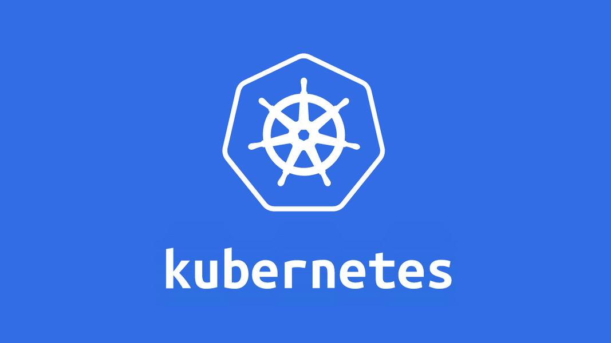
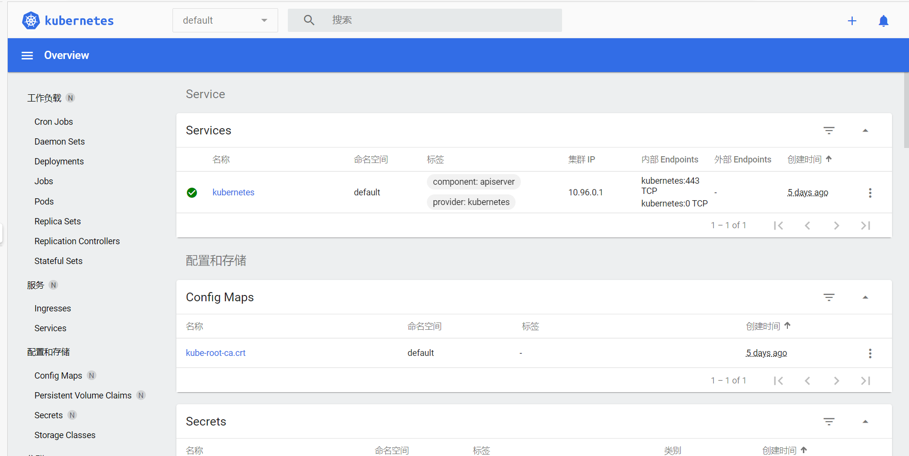
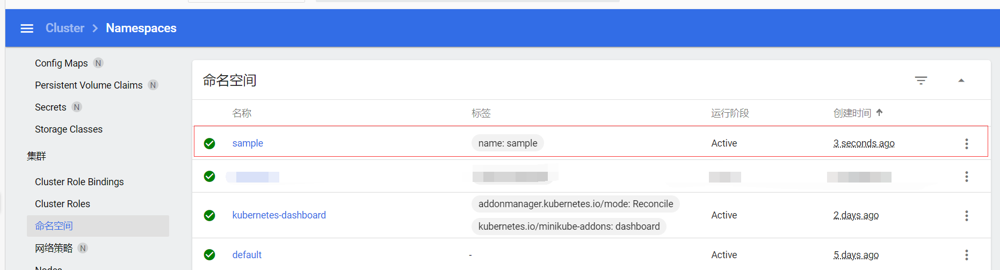
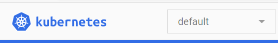

# Kubernetes

*summary*



**Kubernetes**是一个容器编排工具，也叫k8s

- 阿里云上有免费的K8S公开课，讲的非常不错，网课地址：[CNCF × Alibaba 云原生技术公开课 - 阿里云全球培训中心 - 官方网站，云生态下的创新人才工场 (aliyun.com)](https://edu.aliyun.com/course/1651)
- K8S统一通过**HTTP+YAML（或JSON）**来设置各项配置或执行各项操作

---

*pinned*

### 安装kubectl

> [Kubernetes（k8s）中文文档 安装和设置kubectl_Kubernetes中文社区](https://www.kubernetes.org.cn/installkubectl)

- kubectl是终端和k8s交互的工具
- 安装kubectl
  - 国内的下载地址请到[这里](https://github.com/kubernetes/kubernetes/tree/master/CHANGELOG)寻找，以当前版本为例，下载链接位置在[kubernetes/CHANGELOG-1.22.md at master · kubernetes/kubernetes (github.com)](https://github.com/kubernetes/kubernetes/blob/master/CHANGELOG/CHANGELOG-1.22.md#client-binaries)，然后替换curl的下载链接，如`curl -LO https://dl.k8s.io/v1.22.0-beta.0/kubernetes-client-linux-amd64.tar.gz`
  - `tar -zxvf kubernetes-client-linux-amd64.tar.gz `：解压文件
  - `cd kubernetes/client/bin`：进入目录
  - `chmod +x ./kubectl`：使二进制文件可执行
  - `sudo mv ./kubectl /usr/local/bin/kubectl`：二进制文件移动到PATH中

### 本地安装虚拟集群minikube

> [minikube start | minikube (k8s.io)](https://minikube.sigs.k8s.io/docs/start/)
>
> [The "docker" driver should not be used with root privileges. · Issue #7903 · kubernetes/minikube (github.com)](https://github.com/kubernetes/minikube/issues/7903)

- K8S本身是面向集群设计的，也就是至少两台机器参与其中。那么minikube就提供一种部署单机集群的方式。
- 安装minikube

  - `curl -LO https://storage.googleapis.com/minikube/releases/latest/minikube-linux-amd64`
- `sudo install minikube-linux-amd64 /usr/local/bin/minikube`
- 新建一个用户，并加入docker组（因为root权限用户去启动minikube是不被允许的）
  - `sudo groupadd docker`：创建docker组
  - `adduser your_user`：新建用户`your_user`
  - `passwd your_user`：修改`your_user`密码
  - `sudo usermod -aG docker your_user`：将`your_user`加入docker组
- 启动minikube
  - `su your_user`：切换到`your_user`用户
  - `minikube start`：开启minikube
- 查看minikube面板
  - `minikube dashboard`：**本地**访问其中的网址即可打开k8s面板
  
    

---

*2021.06.30*

### Namespace

```yaml
apiVersion: v1
kind: Namespace
metadata:
  name: sample
  labels:
    name: sample
```

#### UI方式

- 获取当前命名空间列表



- 在顶部可以切换命名空间

  


---

*2021.07.11*

### liveness Probe存活探针

> [kubernetes就绪探针readinessProbe_chuxiong5717的博客-CSDN博客](https://blog.csdn.net/chuxiong5717/article/details/100827895)

k8s可以访问服务的一个接口来判断是否可以对外提供服务，**如果发现不健康，则重启服务**

- 准备一个用于返回服务就绪的接口，比如/liveness，让他能快速返回200即可

  ```java
  //提供给k8s检测
  @GetMapping("/liveness")
  public String readiness(){
      return "yes";
  }
  ```

- 在k8s的yaml配置文件里写入探针配置，之后k8s会按照配置的时间进行轮询，这里的意思是，启动部署20s后，每隔10s就再次访问一次。 **注意：务必放行接口**

  ```yaml
  spec:
    containers:
      livenessProbe:
        httpGet:
          port: 80
          path: /readiness
        initialDelaySeconds: 20
        periodSeconds: 10
  ```
  - `httpGet.host`：默认是Pod IP
  - `initialDelaySeconds`：第一次检测延迟秒数，设置的要尽量长，保证服务完全启动
  - `periodSeconds`：轮询检测秒数。

