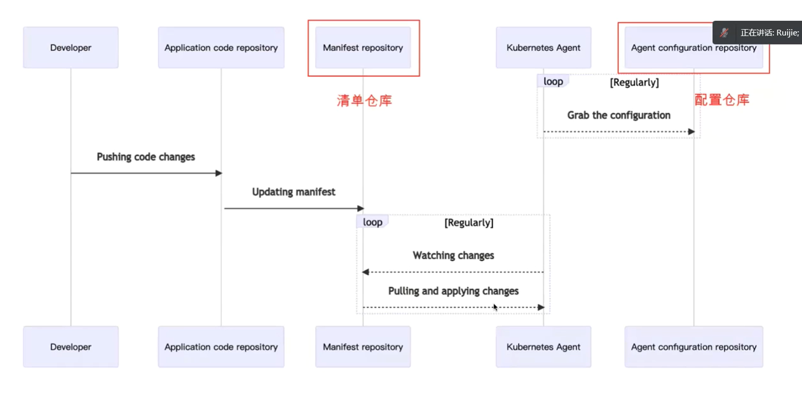

# Kubernetes

*summary*


**Kubernetes**是一个容器编排工具，也叫k8s

- 阿里云上有免费的K8S公开课，讲的非常不错，网课地址：[CNCF × Alibaba 云原生技术公开课 - 阿里云全球培训中心 - 官方网站，云生态下的创新人才工场 (aliyun.com)](https://edu.aliyun.com/course/1651)
- K8S统一通过**HTTP+YAML（或JSON）**来设置各项配置或执行各项操作

---

*pinned*

### 安装kubectl

> [Kubernetes（k8s）中文文档 安装和设置kubectl_Kubernetes中文社区](https://www.kubernetes.org.cn/installkubectl)

- kubectl是终端和k8s交互的工具
- 安装kubectl
  - 国内的下载地址请到[这里](https://github.com/kubernetes/kubernetes/tree/master/CHANGELOG)寻找，以当前版本为例，下载链接位置在[kubernetes/CHANGELOG-1.22.md at master · kubernetes/kubernetes (github.com)](https://github.com/kubernetes/kubernetes/blob/master/CHANGELOG/CHANGELOG-1.22.md#client-binaries)，然后替换curl的下载链接，如`curl -LO https://dl.k8s.io/v1.22.0-beta.0/kubernetes-client-linux-amd64.tar.gz`
  - `tar -zxvf kubernetes-client-linux-amd64.tar.gz `：解压文件
  - `cd kubernetes/client/bin`：进入目录
  - `chmod +x ./kubectl`：使二进制文件可执行
  - `sudo mv ./kubectl /usr/local/bin/kubectl`：二进制文件移动到PATH中

### 本地安装虚拟集群minikube

> [minikube start | minikube (k8s.io)](https://minikube.sigs.k8s.io/docs/start/)
>
> [The "docker" driver should not be used with root privileges. · Issue #7903 · kubernetes/minikube (github.com)](https://github.com/kubernetes/minikube/issues/7903)

- K8S本身是面向集群设计的，也就是至少两台机器参与其中。那么minikube就提供一种部署单机集群的方式。
- 安装minikube

  - `curl -LO https://storage.googleapis.com/minikube/releases/latest/minikube-linux-amd64`
- `sudo install minikube-linux-amd64 /usr/local/bin/minikube`
- 新建一个用户，并加入docker组（因为root权限用户去启动minikube是不被允许的）
  - `sudo groupadd docker`：创建docker组
  - `adduser your_user`：新建用户`your_user`
  - `passwd your_user`：修改`your_user`密码
  - `sudo usermod -aG docker your_user`：将`your_user`加入docker组
- 启动minikube
  - `su your_user`：切换到`your_user`用户
  - `minikube start`：开启minikube
- 查看minikube面板
  - `minikube dashboard`：**本地**访问其中的网址即可打开k8s面板
  
    

---

*2021.06.30*

### Namespace

```yaml
apiVersion: v1
kind: Namespace
metadata:
  name: sample
  labels:
    name: sample
```

#### UI方式

- 获取当前命名空间列表


- 在顶部可以切换命名空间

  


---

*2021.07.11*

### liveness Probe存活探针

> [kubernetes就绪探针readinessProbe_chuxiong5717的博客-CSDN博客](https://blog.csdn.net/chuxiong5717/article/details/100827895)

k8s可以访问服务的一个接口来判断是否可以对外提供服务，**如果发现不健康，则重启服务**

- 准备一个用于返回服务就绪的接口，比如/liveness，让他能快速返回200即可

  ```java
  //提供给k8s检测
  @GetMapping("/liveness")
  public String readiness(){
      return "yes";
  }
  ```

- 在k8s的yaml配置文件里写入探针配置，之后k8s会按照配置的时间进行轮询，这里的意思是，启动部署20s后，每隔10s就再次访问一次。 **注意：务必放行接口**

  ```yaml
  spec:
    containers:
      livenessProbe:
        httpGet:
          port: 80
          path: /readiness
        initialDelaySeconds: 20
        periodSeconds: 10
  ```
  - `httpGet.host`：默认是Pod IP
  - `initialDelaySeconds`：第一次检测延迟秒数，设置的要尽量长，保证服务完全启动
  - `periodSeconds`：轮询检测秒数。

---

*2021.08.25*

### kt-connect的安装与使用

> [Downloads (alibaba.github.io)](https://alibaba.github.io/kt-connect/#/en-us/downloads)

- 先安装依赖sshuttle：`pip install sshuttle`

- 然后安装kt-connect

  ```shell
  $ curl -OL https://github.com/alibaba/kt-connect/releases/download/v0.1.0/ktctl_0.1.0_linux_amd64.tar.gz
  $ tar -xzvf ktctl_linux_amd64.tar.gz
  $ mv ktctl_linux_amd64 /usr/local/bin/ktctl
  $ ktctl -h
  ```


---

*2021.11.04*

### 在GitLab中配置项目级Kubernetes Agent

> [Install the GitLab Kubernetes Agent | GitLab](https://docs.gitlab.com/ee/user/clusters/agent/install/index.html)

#### 在仓库中添加配置文件

- 给仓库添加一个`.gitlab/agents/<agent_name>/config.yaml`。agent_name自定，这里取`my_agent`为例

- 添加最简单的一个配置：

  ```yaml
  gitops:
    manifest_projects:
    - id: "path-to/your-manifest-project-1"
      paths:
      - glob: '/**/*.{yaml,yml,json}'
  ```

  - project_id可以从网址的URL中获取，从根群组名到项目名为止。`/projects/../...`

#### 配置一个新的GitLab Agent

- **基础设施 > Kubernetes集群 > GitLab Agent管理的集群**，可以新建一个agent。由于我们已经为该仓库添加了配置文件，因此可以进行下一步的操作。
- 在下拉列表里选择刚刚的`my_agent`
- 然后好好保存**只会出现一次**的注册令牌，比如这样`368XLdWcwX1rqYQxrN4DP3yiGtzeoSR7j-2BzSszd7QyKoydmQ`

#### 在Kubernetes集群中下载Agent

- 创建命名空间：`kubectl create namespace gitlab-kubernetes-agent`

- 用一行代码安装（实际上|前的这一段就是去根据参数生成一个k8s的yaml配置文件）：

  ```
  docker run  --rm \
      registry.gitlab.com/gitlab-org/cluster-integration/gitlab-agent/cli:stable generate \
      --agent-token=368XLdWcwX1rqYQxrN4DP3yiGtzeoSR7j-2BzSszd7QyKoydmQ \
      --kas-address=wss://kas.gitlab.cn \
      --agent-version stable \
      --namespace gitlab-kubernetes-agent | kubectl apply -f -
  ```
  
  - 云厂商管理的K8S集群通常无法执行完整的命令，我们就**手动执行前半段命令**来得到yaml文件，喂给集群创建即可。
  

### 在GitLab中为群组添加一个已存在的集群

> [Add existing cluster · Clusters · Project · User · 帮助 · GitLab](https://gitlab.cn/help/user/project/clusters/add_existing_cluster.md)

- **某群组 > Kubernetes > 连接现有集群**

- **Kubernetes 集群名称**：自己随便取一个
- **环境范围**：默认为`*`，在配置多个集群的情况下这一项需要变动。主要用于CI/CD中`environment`项的配置
- **API地址**：`kubectl cluster-info | grep -E 'Kubernetes master|Kubernetes control plane' | awk '/http/ {print $NF}'`

- **CA证书**：
  - `kubectl get secret`：找到一个类似`default-token-xxxxx`的name
  - `kubectl get secret <上面的name> -o jsonpath="{['data']['ca\.crt']}" | base64 --decode`

- **Token**：

  - 新建一个`gitlab-admin-service-account.yaml`：

    ```yaml
     apiVersion: v1
    kind: ServiceAccount
    metadata:
      name: gitlab
      namespace: kube-system
    ---
    apiVersion: rbac.authorization.k8s.io/v1
    kind: ClusterRoleBinding
    metadata:
      name: gitlab-admin
    roleRef:
      apiGroup: rbac.authorization.k8s.io
      kind: ClusterRole
      name: cluster-admin
    subjects:
      - kind: ServiceAccount
        name: gitlab
        namespace: kube-system
    ```

  - `kubectl apply -f gitlab-admin-service-account.yaml`

    - 成功的话会看到：

      ````
      serviceaccount/gitlab created
      clusterrolebinding.rbac.authorization.k8s.io/gitlab-admin created
      ````

    - 如果需要admin权限，就输入账密`kubectl apply -f gitlab-admin-service-account.yaml --username=admin --password=<password>`

  - `kubectl -n kube-system describe secret $(kubectl -n kube-system get secret | grep gitlab | awk '{print $1}')`，并复制token部分

- 另外如果之后要配置Prometheus，可能会遇到无法下载k8s.grc.io镜像的问题，可以参考[k8s.gcr.io、gcr.io仓库的镜像下载 - 码农教程 (manongjc.com)](http://www.manongjc.com/detail/22-ygajzoiprrvtpga.html)。[在国内网络环境下从k8s.gcr.io下载镜像问题 | DevOps (centoscn.vip)](https://www.centoscn.vip/2322.html)。[k8s.gcr.io 镜像国内拉不下来解决思路](https://www.dqzboy.com/5306.html)。
  - 我的解决方案是把`k8s.gcr.io/kube-state-metrics/kube-state-metrics:v2.2.0`更换为了镜像仓库`bitnami/kube-state-metrics:2.2.0`

---

*2021.11.05*

### 在集群上安装GitLab Runner

> [GitLab Runner Helm Chart | GitLab](https://docs.gitlab.com/runner/install/kubernetes.html#configuring-gitlab-runner-using-the-helm-chart)

- What is GitLab runner Kubernetes?
  GitLab Runner can use Kubernetes to run builds on a Kubernetes cluster. This is possible with the use of the Kubernetes executor. The Kubernetes executor, when used with GitLab CI, connects to the Kubernetes API in the cluster creating a Pod for each GitLab CI Job.
- 难点在于如何去重写`values.yaml`的配置使其有效，下面列举出我所修改的所有配置
- `image: ccchieh/centos-common`：默认是gitlab/gitlab-runner，可以改写成自己想要的镜像。
- `replicas: 5`：runner副本数。大于1时就需要使用`runnerRegistrationToken`而不是`runnerToken`来填写注册令牌。
- `gitlabUrl: https://gitlab.cn/`

---

*2021.12.12*

### GitLab Kubernetes Agent在集群上部署应用



要完成一整条GitOps式的部署流程，是要依靠多个环节共同运作的

- **业务开发者**：业务开发者日常的push代码到**应用仓库**

- **应用仓库**：经常更新业务代码，偶尔需要更新环境配置
- **清单仓库**：专门存储集群应用部署相关的JSON/YAML清单文件
- **Gitlab Kubernetes Agent**：是连接代码仓库和实际集群环境的重要纽带，它会跟踪**清单仓库**的更改，及时的拉取最新清单并在集群中执行
- **配置仓库**：Agent需要如何在GitLab中生效？监听的都是哪些仓库？那么这种Agent的设置文件也是需要一个仓库来存放（即安装Agent时所用到的那个仓库），而且需要放在指定的路径底下：`.gitlab/agents/${agent_name}/config.yaml`

整个过程甚至没有借助CI/CD runner，都是靠Agent自行完成。

在安装过程中没有解释Agent配置文件的含义，现在其实就非常清楚了

```yaml
gitops:
  manifest_projects:
  - id: "path-to/your-manifest-project-1"
    paths:
    - glob: '/**/*.{yaml,yml,json}'
```

- 这里主要在声明清单仓库的相关信息
- 指定了清单仓库的id
- 指定了清单仓库中哪些文件会被监听更改，这个例子里是`/${任意文件夹}/${任意yaml/json文件}`

我们为了方便，**清单仓库**和**配置仓库**就合并成同一个私有仓库，如果要分开也是可以的，但那样清单库就必须公有。

按照这个思路，我们可以按照这个配置放一个nginx的示例文件，测试一下集群会不会实时的（实际上由于各方面的原因会有稍微延迟）发生变化。这里就直接抄了一套云厂商的一个nginx模板，文件就放在了**清单仓库**的`/deploy/nginx.yaml`处：

```yaml
apiVersion: apps/v1 # for versions before 1.8.0 use apps/v1beta1
kind: Deployment
metadata:
  name: nginx-deployment-basic
  labels:
    app: nginx
  namespace: gitlab-kubernetes-agent
spec:
  replicas: 4
  selector:
    matchLabels:
      app: nginx
  template:
    metadata:
      labels:
        app: nginx
    spec:
    #  nodeSelector:
    #    env: test-team
      containers:
      - name: nginx
        image: nginx:1.7.9 # replace it with your exactly <image_name:tags>
        ports:
        - containerPort: 80
          protocol: TCP
        resources:
          limits:
            cpu: "500m"
```

---

*2021.12.20*

### 【长篇】Kubernetes HPA及提供自己的指标数据

> [Kubernetes HPA 的理解 - 简书 (jianshu.com)](https://www.jianshu.com/p/717cdbcf42c3)
>
> [Kubernetes的弹性伸缩（HPA） - 简书 (jianshu.com)](https://www.jianshu.com/p/31ed5c98648e)
>
> [Pod 水平自动扩缩 | Kubernetes](https://kubernetes.io/zh/docs/tasks/run-application/horizontal-pod-autoscale/)
>
> [kubernetes HPA-超详细中文官方文档_韩先超的博客-CSDN博客_hpa kubernetes](https://blog.csdn.net/weixin_38320674/article/details/105460033)
>
> [Kubernetes 基础介绍 · abcdocker运维博客 | Kubernetes集群实战文档 (i4t.com)](https://k.i4t.com/kubernetes.html)
>
> [Kubernetes HPA with Custom Metrics from Prometheus | by Cezar Romaniuc | Towards Data Science](https://towardsdatascience.com/kubernetes-hpa-with-custom-metrics-from-prometheus-9ffc201991e)

> 持续更新中...

当你的应用部署到Kubernetes集群上，出现负载过大的问题时，你可能需要寻求扩展Pod的办法。等到流量高峰一过，你可能还需要寻求缩减闲置Pod的方法。那么一种是垂直伸缩，调整对单个Pod的内存分配和CPU分配。但目前分配资源这一点K8S只能通过终止Pod再使用新配置文件启动的方法去做，因此比较推荐的是另一种，水平伸缩，调整该Pod的副本数量。

水平扩展，Horizontal Pods AutoScaling，简称HPA，可以对Deployment进行按需的自动伸缩。目前K8S可以基于CPU利用率进行自动扩缩，也可以基于其他应用程序所提供的自定义度量指标。

#### 默认HPA


### Pod 容器组

> [Kubernetes中的多容器 Pod 设计模式 (baidu.com)](https://baijiahao.baidu.com/s?id=1717099403061526475&wfr=spider&for=pc)
>
> [kubernetes之多容器pod以及通信 - 周国通 - 博客园 (cnblogs.com)](https://www.cnblogs.com/tylerzhou/p/11009412.html)

- Pod可以翻译为**容器组**，意思就是包含一个或多个容器
- K8S的最小调度单位，也就是说后续涉及的一切操作都只能对Pod进行，而不能对其里面的容器进行
  - 这里就牵扯到为什么现在一个Pod里放一个应用容器是个不成文规定：因为比如前后端+数据库的一个正常web应用放在了一个Pod里，此时如果要创建副本，数据库也会不必要的复制多份。因此如果容器之间不是紧密耦合/生命周期不同，还是建议分散在多个Pod中。

### Service 服务

- 拥有一个唯一的名称：如`mysql-server`
- 对外开放一个固定不变的虚拟IP+端口：如`192.168.0.3:8080`
- 可以由K8S内建的负载均衡机制映射到多个Pod上面
  - 只有开放服务的Pod可以被映射Service

#### Service是如何寻找到他所关联的那些Pod

从Service的角度来看，需要指定一个selector选择器，如`pod_label: myNginx`。所有带有这个标签的Pod就会与之关联。

从Pod的角度来看，需要声明一个labels标签，如`pod_label: myNginx`。

### Replication Controller 副本控制器

- 可以管理Pod的副本数量，如果少于指定的副本数，会使用RC中提前声明的Pod模板来创建一个新的Pod
- 新创建的Pod会被调度到合适的Node上运行

### MasterNode 主节点

- 集群中用来负责管理和控制的控制节点，基本上所有的命令都是发给它
- 上面会运行一组关键进程：
  - API Server：开放HTTP Rest接口，提供对所有资源增删改查（实际上就是输送Yaml文件）的唯一入口
  - Controller Manager：所有的资源对象的自动化控制中心
  - Scheduler：负责资源调度（Pod调度）的进程

- 还会运行一个etcd服务，保存所有**资源对象**的数据

### Node 节点

- 每个Node会被MasterNode**平均的**分配一些Pod
- 除此之外也会有一些关键进程：
  - kubelet：负责Pod对应容器的创建、停止等任务，同时要与Master节点协作
  - kube-proxy：负责Service的通信与负载均衡机制。当然这个负载均衡是针对单Node上的多Pod的软件模式的负载均衡。

---

*2022.02.09*

### ConfigMap 配置项

- 可以存储其他对象所需要使用的配置。 

```yaml
apiVersion: v1
kind: ConfigMap
metadata:
  name: game-demo
data:
  # 类属性键；每一个键都映射到一个简单的值
  player_initial_lives: "3"
  ui_properties_file_name: "user-interface.properties"

  # 类文件键
  game.properties: |
    enemy.types=aliens,monsters
    player.maximum-lives=5    
  user-interface.properties: |
    color.good=purple
    color.bad=yellow
    allow.textmode=true   
```

- 其他对象的配置中可以这么使用：

```yaml
apiVersion: v1
kind: Pod
metadata:
  name: configmap-demo-pod
spec:
  containers:
    - name: demo
      image: alpine
      command: ["sleep", "3600"]
      env:
        # 定义环境变量
        - name: PLAYER_INITIAL_LIVES # 请注意这里和 ConfigMap 中的键名是不一样的
          valueFrom:
            configMapKeyRef:
              name: game-demo           # 这个值来自 ConfigMap
              key: player_initial_lives # 需要取值的键
        - name: UI_PROPERTIES_FILE_NAME
          valueFrom:
            configMapKeyRef:
              name: game-demo
              key: ui_properties_file_name
      volumeMounts:
      - name: config
        mountPath: "/config"
        readOnly: true
  volumes:
    # 你可以在 Pod 级别设置卷，然后将其挂载到 Pod 内的容器中
    - name: config
      configMap:
        # 提供你想要挂载的 ConfigMap 的名字
        name: game-demo
        # 来自 ConfigMap 的一组键，将被创建为文件（/config/game.properties 和 /config/user-interface.properties）
        # 里面的内容就是之前configmap里所写的那些z
        items:
        - key: "game.properties"
          path: "game.properties"
        - key: "user-interface.properties"
          path: "user-interface.properties"
```

- > [K8S 数据卷volumes之ConfigMap_途径日暮不赏丶的博客-CSDN博客](https://blog.csdn.net/weixin_45880055/article/details/117590045)

- 如果要更改容器中挂载的configmap，其实只要在k8s中修改使用的configmap就行了，对应的容器内文件都会同步更改。这个就类似于docker的挂载模式，只不过现在挂载到宿主机的位置是k8s的**ConfigMap**资源

```sh
# 查看
kubctl get cm [-n <namespace>]
kubectl describe cm <ConfigMap名> [-n <namespace>]
# 查看被挂载的pod
kubectl get pod -n <namespace>
# 验证挂载情况
kubectl exec -it <Pod名> -n <namespace> -- sh
```

### 快速重新部署Deployment

> [重启Kubernetes Pod的几种方式 - 梦轻尘 - 博客园 (cnblogs.com)](https://www.cnblogs.com/uglyliu/p/12067315.html)

- Kubernetes可没有`kubectl restart`这种类似Docker重启容器的命令，因此可能要绕着弯去实现。

```sh
# 注意，这是两个步骤，需要先后执行
kubectl scale deployment <Deploy名> --replicas=0 -n <namespace>
kubectl scale deployment <Deploy名> --replicas=1 -n <namespace>
```

