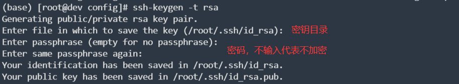
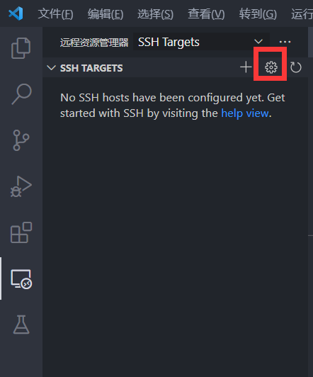

# Linux

*summary*


**Linux**是一个常用的服务器系统

---

*2020.12.24*

### 释放磁盘空间

> [linux如何查看文件和目录大小](https://www.linuxprobe.com/linux-file-look.html)
>
> [“no space left on device”（磁盘空间不足）问题解决](https://blog.csdn.net/youmatterhsp/article/details/80382552)

**问题浮现：**磁盘空间不足的标志性报错为`no space left on device`

**了解情况：**

- `df -h`：查看磁盘使用情况
- `df -i`：查看inode（Linux文件索引）使用情况

**追根溯源：**

- `du -sh * | sort -nr | head`：查看当前目录占用空间最大的10个文件/子目录

### 计划任务同步时间

> [crontab与ntpupdate设置服务器时间同步](https://www.cnblogs.com/dyj0201/p/6477996.html)
>
> [crontab 详细用法、定时任务 、时间规则](https://blog.csdn.net/u013967628/article/details/83504839)

- 查看命令位置：`whereis ntpdate`。得到输出`/usr/bin/ntpdate`
- 立即执行**时间同步**命令：`/usr/bin/ntpdate pool.ntp.org   `
- 定时执行：

  - `crontab -e`进入编辑界面

  - 增加一行`*/5 * * * * /usr/bin/ntpdate pool.ntp.org` （每5分钟执行一次）

---

*2020.12.26*

### 查看所有被占用的端口

- `netstat -tunlp`，其中`-n`可以酌情取舍

---

*2021.01.04*

> 这个问题并未完全解决，以下草稿仅供参考，很可能有杂乱/缺失/错误等情况

>  [Linux查看配置文件中未被注释的有效配置行](https://www.cnblogs.com/gange111/p/9582637.html)

```
external_url 'http://10.11.6.128'
unicorn['worker_timeout'] = 90
unicorn['worker_processes'] = 3
unicorn['worker_memory_limit_min'] = "1024 * 1 << 20"
unicorn['worker_memory_limit_max'] = "1280 * 1 << 20"
 sidekiq['max_concurrency'] = 50
 sidekiq['min_concurrency'] = nil
```

---

*2021.01.05*

### SSH免密登录

> [Linux安全之SSH 密钥创建及密钥登录](https://blog.csdn.net/nahancy/article/details/79059135)

- 如果该台机器还未生成过ssh密钥，则`ssh-keygen -t rsa`来生成密钥在`/root/.ssh`。**如果有的话千万不要做这一步！！！**会覆盖掉旧密钥导致以前的认证全部需要重新执行。

  

- 把公钥`id_rsa.pub`拷贝到需要登录的远程服务器上。

  - **方法一（推荐）：**使用`ssh-copy-id -i /root/.ssh/id_rsa.pub root@xxx.xx.xx.xx`
    
    - 会要求输入远程连接密码
  - 默认端口是22，需要更改时添加参数`-p 端口号`
    
  - **方法二：**手动追加公钥到`authorized_keys`**末尾**（`/root/.ssh/authorized_keys`）

    - 如果远程服务器还没有这个文件：

      ```sh
      touch authorized_keys
      chmod 600 /root/.ssh/authorized_keys
      ```

- 现在照常ssh就可以免密登录啦
  
  - 初次登录可能需要yes确认一下

---

*2021.03.04*

### VS Code远程SSH连接linux

> [使用 VS Code 远程连接Linux服务器进行实时开发](https://blog.csdn.net/weixin_42864357/article/details/105658765)

- 安装插件`Remote Development`

- 配置SSH连接

  - 点击左侧标签栏的**远程资源管理器**，选择小齿轮

    

  - 在`C:\Users\...\.ssh\config`文件里编辑

    - `Host`：主机别名。随意填写。
    - `HostName`：主机地址。
    - `User`：登录的用户。

### 无法SSH连接到Ubuntu虚拟机

> [解决ubuntu 下 SSH无法连接的问题](http://blog.chinaunix.net/uid-69944074-id-5831708.html)

默认Ubuntu不安装ssh服务

- 安装ssh包：`sudo apt-get install ssh`
- 启动ssh服务：`sudo /etc/init.d/ssh start`\
- 修改ssh配置文件以允许root登录：`sudo vi /etc/ssh/sshd_config`，将`PermitRootLogin`的值修改为`yes`
- 保存后重启ssh服务：` service ssh restart`